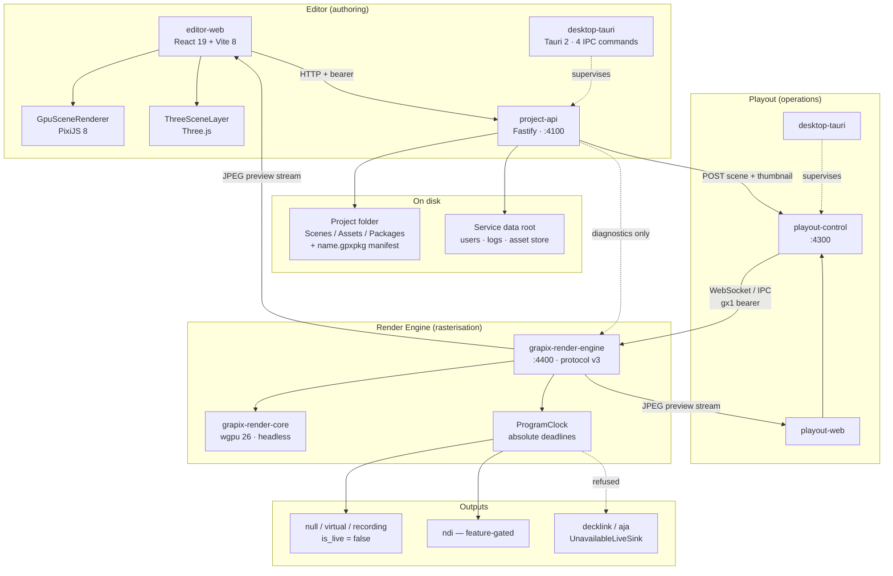

# GrapiX — technical stack and architecture brief

| | |
| --- | --- |
| Branch | `Basic-v0.4-2026-09-06-project-container-material-library` |
| Last commit | `5cd531de9bb0bc6be390d3afe7fc678802c95250` — `feat(materials): implement the tile fit mode in both renderers` (2026-09-06) |
| Working tree at time of writing | clean |
| Method | Written by reading the repository at that commit. Every claim cites a path. |

## Status vocabulary

Used throughout, and applied per capability rather than per subsystem.

| Term | Meaning |
| --- | --- |
| **Implemented** | Code exists and is exercised by automated tests in this repository. |
| **Partial** | A meaningful path exists, but coverage is incomplete or a stated case is refused. |
| **Planned** | Named in a contract, type or document; no runtime implementation found. |
| **External gate** | Completion requires a vendor SDK, hardware, or a certification run that cannot happen in this checkout. |

No claim about production readiness or suitability is made anywhere in this document.

---

## 1. Summary

- GrapiX is a broadcast graphics platform split into three products — **Editor** (authoring), **Playout** (operations), **Render Engine** (rasterisation) — with `Shared/` holding contracts consumed by all three and depending on none (`README.md`, `tools/architecture/check-workspace-boundaries.mjs`).
- The npm workspace holds **19 Shared entries, 8 Editor entries and 4 Playout entries** as reported by `npm run check:boundaries`; roots are declared in `package.json` (`workspaces`).
- Rendering is split: the browser draws authoring previews with PixiJS and Three.js (`Editor/apps/editor-web/src/rendering/`), while a native Rust + wgpu engine is the only renderer that produces Program pixels (`services/render-engine/`, `services/render-daemon/`).
- Persistence is **JSON files on disk**, not a database — atomic temp-write-then-rename (`Editor/services/project-api/src/storage.ts`). No SQL engine, schema or migration directory exists in the repository.
- Editor and Playout each ship a Tauri 2 desktop shell (`Editor/apps/desktop-tauri/`, `Playout/apps/desktop-tauri/`); an older Electron shell is retained (`Editor/apps/desktop-electron/`).

---

## 2. Frontend

### Editor UI stack

Declared in `Editor/apps/editor-web/package.json`; versions resolved from `package-lock.json` (lockfileVersion 3).

| Concern | Choice | Resolved version |
| --- | --- | --- |
| Framework | React + React DOM | 19.2.8 |
| Build tool | Vite | 8.1.5 |
| State | Zustand | 4.5.7 |
| 2D raster | PixiJS | 8.19.0 |
| 3D | Three.js | 0.185.1 |
| Docking | dockview / dockview-react | 8.2.0 |
| Panel resize | react-resizable-panels | 4.12.1 |
| Icons | lucide-react | 0.468.0 |
| Zip (client side) | JSZip | 3.10.1 |
| Desktop bridge | `@tauri-apps/api` | 2.11.1 |

### Viewport rendering path — Implemented

Two stacked canvases rather than one:

- `Editor/apps/editor-web/src/rendering/GpuSceneRenderer.ts` — PixiJS path. Resolves a scene asset source to the project service before loading (`resolveProjectAssetUrl`, line ~486) because a relative path would resolve against the page origin.
- `Editor/apps/editor-web/src/rendering/ThreeSceneLayer.ts` — Three.js path, depth-tested. Its canvas carries `className = "gpu-three-canvas"`. Content is **not** mirrored to convert GrapiX's Y-down canvas to Three's Y-up world; the conversion is applied to positions (`canvasToWorldY`) so geometry winding and UVs are untouched — the constructor comment records that mirroring the parent previously inverted every textured surface.
- `Editor/apps/editor-web/src/rendering/sceneMaterial.ts` — resolves material slots and per-face surfaces into renderable objects shared by both paths.

Textures from the project are fetched through `Editor/apps/editor-web/src/lib/projectAssets.ts`, which attaches the session bearer and returns a blob URL keyed on the content route's ETag — loaders such as `TextureLoader`, `GLTFLoader`, Pixi's loader and `` cannot attach a header themselves.

### Panels

39 component modules exist under `Editor/apps/editor-web/src/components/`. Named panels include `ObjectManager`, `Inspector` / `PropertiesSidebar`, `TimelinePanel`, `AutomationPanel`, `FontManagerPanel`, `TemplatesPanel`, `ObjectLibrary`, `RenderEnginePanel`, `AeControlsPanel`, `DiagnosticsConsole`, `AssistantPanel`, `CanvasStage`, `GpuSceneStage`, `DockWorkspace`, `MenuBar`, `StatusBar`. The Material Manager is a module rather than a single component (`Editor/apps/editor-web/src/modules/material-manager/`), as is the Object Inspector (`.../modules/object-inspector/`).

---

## 3. Backend / core

### Rust projects — four, not one workspace

There is **no single Cargo workspace**. Four independent crates each carry their own `Cargo.lock`:

| Path | Crate | Version | Role |
| --- | --- | --- | --- |
| `services/render-engine/` | `grapix-render-engine` | 0.2.0 | Binary. Protocol v3 server, tiling, stage, Program, outputs, preview. |
| `services/render-daemon/` | `grapix-render-core` | 0.1.0 | Library only. Scene parsing, mesh/material/text preparation, wgpu rendering, output adapters. |
| `Editor/apps/desktop-tauri/src-tauri/` | `app` | 0.1.0 | Editor desktop shell. |
| `Playout/apps/desktop-tauri/src-tauri/` | `playout-app` | 0.2.0 | Playout desktop shell. |

`services/render-engine/Cargo.toml` records why the directory name and crate name disagree: the folder is still `render-daemon` so git history stays attached, after the protocol-v2 daemon binary that gave it the name was removed.

Both engine crates declare `rust-version = "1.87"`; both Tauri shells declare `rust-version = "1.77.2"`.

### Desktop shell — Implemented

Tauri 2 (`tauri` resolved 2.11.5, `tauri-build` 2.6.3). `Editor/apps/desktop-tauri/src-tauri/tauri.conf.json` sets `frontendDist` to `../../editor-web/dist`, `devUrl` to `http://localhost:5173`, and `bundle.targets` to `all`.

The Editor shell's **entire Tauri IPC surface is four commands** (`Editor/apps/desktop-tauri/src-tauri/src/lib.rs`):

| Command | Line | Purpose |
| --- | --- | --- |
| `supervisor_status` | 31 | Reports supervised process state to the status bar. |
| `pick_ae_project` | 45 | Native file dialog for an After Effects project. |
| `pick_project_folder` | 55 | Native folder dialog. |
| `pick_project_save_path` | 71 | Native save dialog for a `.gpxpkg` project file. |

The dialog is `rfd` 0.15 used directly rather than `tauri-plugin-dialog`; the manifest comment states this avoids adding a frontend package and a capability permission for one call. Process supervision lives in `Editor/apps/desktop-tauri/src-tauri/src/supervisor.rs`.

### Graphics API and frame loop

- **Graphics API: wgpu 26.0.1** (`services/render-engine/Cargo.toml`, `services/render-daemon/Cargo.toml`). Both pin the major deliberately — the manifests state wgpu majors change APIs frequently and must be upgraded together.
- **Windowing: none in the engine.** No `winit` or equivalent appears in `services/render-engine/Cargo.lock`; `raw-window-handle` 0.6.2 is present transitively. `services/render-daemon/src/renderer/gpu.rs` requests an adapter for "headless rendering". The engine is a headless service; windowing is the Tauri WebView's.
- **Frame loop:** `services/render-engine/src/program.rs`. Deadlines are computed absolutely from the frame number rather than accumulated, and late frames are dropped rather than queued (module comment, and `rate.deadline_nanos(next)` at line ~103). A two-stage loop requests frames a configurable lead ahead of the deadline and presents at the deadline.
- **Rational frame rates** are modelled as numerator/denominator (`FrameRate` in `services/render-engine/src/stage.rs`).

### Stage and tiling — Implemented

`services/render-engine/src/stage.rs` sets `MAX_LOGICAL_CANVAS_DIMENSION = 50_000.0` and provides `exceeds_texture_limit()` / `fits_texture_limit()` so a logical canvas larger than the GPU's texture limit is rendered as tiles with overscan. A parallel TypeScript implementation is `Shared/tile-system/`.

### Process model

Ports are registered in `Shared/service-discovery/src/ports.ts` and verified by `npm run check:ports` (`tools/architecture/check-ports.mjs`).

| Port | Process | Env override |
| --- | --- | --- |
| 4100 | Editor project service (Fastify) | `GRAPIX_API_PORT` |
| 4150 | Editor MCP server, `--http` transport only | `GRAPIX_MCP_PORT` |
| 4160 | Editor assistant service | `GRAPIX_ASSISTANT_PORT` |
| 4300 | Playout control service | `GRAPIX_PLAYOUT_PORT` |
| 4400 | Render engine (WebSocket) | `GRAPIX_ENGINE_PORT` |
| 4401–4403 | Additional render nodes, scanned in order | per node |
| 4784 | Adobe MCP gateway | `GRAPIX_ADOBE_GATEWAY_PORT` |
| 5173 / 5174 / 5199 | Vite dev servers (Editor, Playout, second Editor) | — |
| 5353 | mDNS discovery (RFC 6762) | — |
| 4200 | **Retired** — protocol v2 daemon; recorded as unclaimable | — |

`README.md` states the Editor shell *ensures* an engine is running — adopting one already up and never stopping it on window close — and that Playout's shell behaves the same way with its own control service.

---

## 4. Data and packaging

### Persistence — Implemented

`Editor/services/project-api/src/storage.ts` writes JSON documents using temp-file + atomic rename. There is **no SQL database**: no `sqlite`, `better-sqlite3` or `rusqlite` dependency appears in any `package.json` or `Cargo.toml`, and no `migrations/` directory exists.

Two roots, separated deliberately:

- **Service data root** — `Editor/services/project-api/src/dataRoot.ts`. Defaults to `<repo>/data`, overridable with `GRAPIX_DATA_ROOT`. Holds service state: the open-project pointer, the After Effects root registry, the user table, logs, the content-addressed asset store and rundowns.
- **Project root** — `Shared/shared-types/src/projectWorkspace.ts` and `Editor/services/project-api/src/projectWorkspace.ts`. A folder the operator chooses. Scenes, backups, autosaves and packages resolve through `projectFolder()`, which throws `NO_PROJECT_OPEN` when no project is open. Reads degrade to empty instead (`listScenes`).

Project folder layout (`PROJECT_FOLDERS`): `Scenes`, `AEP Footage`, `Assets/Images`, `Assets/Videos`, `Assets/Audio`, `Assets/Fonts`, `Assets/Models`, `Packages`, `Autosaves`, `Backups`.

### Asset model — Implemented

Two addressing schemes coexist, for different jobs:

| Store | Addressed by | Where |
| --- | --- | --- |
| Content-addressed asset store | SHA-256 of contents | `storage.ts` — `importAssetBuffer` writes `assets/<kind>/asset_<hash>.<ext>` with a sidecar record |
| Project asset library | Project-relative path | `Editor/services/project-api/src/projectAssets.ts` — the asset folders are scanned and each file becomes a `ProjectAssetReference` |

`Shared/shared-types/src/projectWorkspace.ts` records the reason for path identity: replacing a file in place must keep every material bound to it, which a content hash would not.

Image geometry and alpha are read from file headers rather than assumed (`Editor/services/project-api/src/imageProbe.ts` — PNG including `tRNS`, JPEG behind EXIF, WebP `VP8`/`VP8L`/`VP8X`, GIF, BMP). An unreadable header yields no width, height or alpha rather than a default.

### Package format — Implemented

`Editor/services/project-api/src/packageBuilder.ts`. A DEFLATE zip (JSZip) named `<slug>.gpxpkg` containing:

`manifest.json`, `scene.json`, `materials.json`, `bindings.json`, `timeline.json`, `metadata.json`, `checksums.json`, plus `fonts.json` and `automation.json` when present, and packaged asset files.

### Integrity — Implemented

- Every packaged file is hashed with SHA-256; `checksums.json` declares `algorithm: "sha256"` and the per-file map (lines 39, 89–91).
- `verifyScenePackage` reopens the finished bytes with `checkCRC32: true`, requires every file the manifest names, and re-hashes each declared asset, failing on any mismatch (lines 117–167). The comment states publishing is all-or-nothing.
- Manifest version is pinned: `packageVersion: 2` and `minimumRendererProtocolVersion: 2` are rejected if different (line ~125).

### Format identity

Both the project manifest and the published scene package use the `.gpxpkg` extension, so each manifest declares a `kind` — `"project"` or `"scene-package"` — and readers discriminate on it rather than on which fields are present (`Shared/shared-types/src/projectWorkspace.ts`, `GpxpkgKind`).

---

## 5. Control and automation surfaces

| Surface | Status | Evidence |
| --- | --- | --- |
| Scene scripting SDK | **Partial** | `Shared/grapix-sdk/src/index.ts` exports `GRAPIX_SDK_VERSION`, `GRAPIX_SCENE_SCRIPT_API_VERSION = 1`, `defineSceneScript`, `evaluateCondition`, `GrapixSequenceEngine`, `createSceneScriptApi`. Static import restrictions are applied at import time in `Editor/services/project-api/src/importers/sceneScriptImporter.ts`. |
| Isolated script execution | **Planned** | No worker, isolate or CPU/memory-bounded host found. `memory.md` records production arbitrary JavaScript as Planned pending a disposable isolated worker. |
| MCP server (Editor) | **Implemented** | `Editor/services/editor-mcp/` with tools `adobe`, `assets`, `data`, `imports`, `knowledge`, `materials`, `objects`, `publish`, `rundowns`, `scenes` (`src/tools/`). Default transport is stdio; HTTP binds 4150 only with `--http` (`src/config.ts`, `src/index.ts`). |
| Adobe bridge | **Partial** | `Editor/services/adobe-mcp-gateway/` (port 4784) plus `Shared/adobe-common-schema/`, `Shared/grapix-adobe-client/`. |
| After Effects runtime container | **Partial / External gate** | `Shared/ae-runtime-contract/`, engine modules `ae_ingress.rs`, `ae_ring_source.rs`, `ae_runtime_client.rs`, `ae_schedule.rs`, seven `ae*` services in `Playout/services/playout-control/src/`, and a C++ plug-in in `ae-plugin/runtime-adapter/`. Requires an installed, licensed After Effects. |
| Data bindings | **Partial** | Binding types live in `Shared/shared-types`; the package build emits `bindings.json`. Live updates travel as `playout.update` (`Shared/render-protocol/src/messages.ts:770`). |
| Sequencing / rundowns | **Partial** | Rundown persistence in `storage.ts` (`saveRundown`, `listRundowns`); `GrapixSequenceEngine` in the SDK; MCP `rundowns` tool. |
| Automation evaluation | **Partial** | `Editor/services/project-api/` evaluates trigger action plans; `memory.md` records that it never executes them. |
| **MOS protocol** | **Not present** | No match for MOS, `mosObj` or `ncsItem` anywhere in `Editor`, `Playout`, `Shared`, `services` or `docs`. Not determined from source whether it is intended. |
| Timecode | **Planned** | The string appears in MCP tool descriptions and AE video metadata (`Editor/services/project-api/src/ae/videoMetadata.ts`); no timecode runtime module exists in `Playout/services/playout-control/src/`. |

### Protocol and auth — Implemented

- **Version 3**, fixed as a constant: `ENGINE_PROTOCOL_VERSION = 3` (`Shared/render-protocol/src/envelope.ts:17`), with `PROTOCOL_VERSION_MISMATCH` among the error codes (line 301).
- **Envelope fields** (lines 178–193): `protocolVersion`, `messageId`, `requestId`, `engineId`, `sceneRef`, `timestampMs`, `type`, `requiresAck`, `sequence`, `direction`.
- **Transports:** WebSocket (`services/render-engine/src/transport.rs`, `tokio-tungstenite` 0.26.2) and local IPC — named pipe on Windows, Unix socket elsewhere (`services/render-engine/src/ipc.rs`).
- **Tokens:** `gx1.<base64url(payload)>.<base64url(HMAC-SHA256(key, "gx1." + payload))>`, specified in `Shared/auth-contract/src/token.ts` and verified in `services/render-engine/src/auth.rs` using `hmac` 0.12.1 + `sha2` 0.10.9. The file states the `gx1` prefix *is* the algorithm, fixed at parse time, so algorithm confusion is not possible.
- **Program recovery journal:** `services/render-engine/src/recovery.rs` — a checksummed write-ahead log entered before acknowledgement, snapshot written to a temp file, fsynced, atomically renamed, directory synced. Restore starts output-inhibited.

---

## 6. Output paths

`services/render-engine/src/outputs.rs`. `is_live()` is the discriminator between outputs that reach an audience and those that do not; `hardware_certified()` is explicitly never derived from a compile-time feature flag (module comment, lines 17–20).

| Adapter | `is_live` | Status | Evidence |
| --- | --- | --- | --- |
| `null` | false | **Implemented** | line ~253 |
| `virtual` | false | **Implemented** — headless render at full Program resolution, retained for inspection, never leaves the machine | line ~319 |
| `recording` | false | **Implemented** | line ~396 |
| `ndi` | true | **External gate** — behind the `ndi` Cargo feature; `grafton-ndi` 1.0.0 dynamically loads the vendor SDK and the manifest states enabling the feature never bundles it | `Cargo.toml` `[features]`; `outputs.rs:22`, 501–536 |
| `decklink` | true | **Planned** — constructed as `UnavailableLiveSink` with the reason "the DeckLink SDK and a certified device are required; not implemented" | lines 1427–1431 |
| `aja` | true | **Planned** — same `UnavailableLiveSink` treatment | lines 1433–1438 |

`LIVE_ADAPTER_IDS = ["ndi", "decklink", "aja"]` (line 1446). An unknown adapter id is refused with the list of offered adapters rather than defaulted (line ~1440).

### Feature flags

| Crate | Feature | Default | Effect |
| --- | --- | --- | --- |
| `grapix-render-engine` | `ndi` | off | Enables `grapix-render-core/ndi` and the optional `grafton-ndi` dependency. The manifest states this makes the adapter *compilable*, never certified. |
| `grapix-render-core` | `ndi` | off | Retained for caller feature compatibility; the manifest records that NDI transmission moved to the engine and this creates no sender. |

**SDI is not implemented in any form.** No DeckLink or AJA SDK binding appears in either `Cargo.toml`.

---

## 7. Runtime architecture

### Walkthrough

1. **Author.** The operator works in `editor-web`. Nothing reaches disk until they save; `Editor/apps/editor-web/src/lib/ensureProject.ts` prompts for a project location on the first save, and the service refuses writes with `NO_PROJECT_OPEN` until one exists.
2. **Persist.** `project-api` writes the scene into `<project>/Scenes` with temp-write-then-rename, keeping backups and an autosave ring in sibling folders (`storage.ts`).
3. **Publish.** `File ▸ Publish to Playout` saves, captures a viewport thumbnail and posts the document to Playout's control service (`Editor/apps/editor-web/src/lib/playoutPublisher.ts`). `packageBuilder.ts` builds the checksummed `.gpxpkg` for the export path.
4. **Load and prepare.** Playout drives the engine over protocol v3 — WebSocket or local IPC, authenticated with a `gx1` token. The engine parses the `SceneDocument`, prepares meshes, materials and shaped text off the render thread (`services/render-daemon/src/scene/mesh_prepare.rs`).
5. **Cue and take.** Playout cues a revision-checked scene and takes it to Program. Only the `cut` transition is accepted; anything else is refused with the message that the engine "will not substitute a cut" (`services/render-engine/src/engine.rs:1686–1691`).
6. **Render at rate.** `ProgramClock` computes each frame's absolute deadline from its frame number and drops late frames rather than queueing them (`program.rs`).
7. **Output.** Frames go to every configured adapter. `is_live()` reports which are on air; SDI adapters refuse to configure.
8. **Monitor.** Preview and Program travel to the Editor viewport and Playout monitors as bounded JPEG streams, addressed to the subscribing client (`services/render-engine/src/stream.rs`, `preview.rs`).

---

## 8. Dependency table

Versions are resolved values from `package-lock.json` (lockfileVersion 3) and from `cargo metadata` against the checked-in `Cargo.lock` files. Licences are the SPDX strings the packages themselves declare.

### JavaScript / TypeScript

| Name | Version | Purpose | Licence |
| --- | --- | --- | --- |
| react / react-dom | 19.2.8 | Editor and Playout UI framework | MIT |
| vite | 8.1.5 | Dev server and bundler | MIT |
| typescript | 5.9.3 | Language and type checking | Apache-2.0 |
| pixi.js | 8.19.0 | 2D authoring preview renderer | MIT |
| three | 0.185.1 | 3D authoring preview renderer | MIT |
| zustand | 4.5.7 | Editor state stores | MIT |
| dockview / dockview-react | 8.2.0 | Dockable panel workspace | MIT |
| react-resizable-panels | 4.12.1 | Panel splitters | MIT |
| lucide-react | 0.468.0 | Icon set | ISC |
| jszip | 3.10.1 | `.gpxpkg` zip construction | MIT OR GPL-3.0-or-later |
| fastify | 5.10.0 | Project and Playout HTTP services | MIT |
| @tauri-apps/api | 2.11.1 | Frontend bridge to the desktop shell | Apache-2.0 OR MIT |
| @vitejs/plugin-react | 6.0.4 | React transform for Vite | MIT |
| tsx | 4.23.0 | TypeScript execution for services in dev | MIT |

### Rust

| Name | Version | Purpose | Licence |
| --- | --- | --- | --- |
| wgpu | 26.0.1 | Graphics API — all GPU rendering | MIT OR Apache-2.0 |
| tokio | 1.53.1 | Async runtime | MIT |
| tokio-tungstenite | 0.26.2 | Protocol v3 WebSocket transport | MIT |
| serde / serde_json | 1.0.229 / 1.0.151 | Scene and protocol (de)serialisation | MIT OR Apache-2.0 |
| glam | 0.29.3 | Vector and matrix maths | MIT OR Apache-2.0 |
| gltf | 1.4.1 | glTF model import | MIT OR Apache-2.0 |
| image | 0.25.10 | PNG / JPEG (+ WebP in core) decode | MIT OR Apache-2.0 |
| cosmic-text | 0.14.2 | Text shaping and layout | MIT OR Apache-2.0 |
| lyon_tessellation | 1.0.20 | Vector path tessellation | MIT OR Apache-2.0 |
| bytemuck | 1.25.2 | GPU buffer casting | Zlib OR Apache-2.0 OR MIT |
| hmac | 0.12.1 | `gx1` token verification | MIT OR Apache-2.0 |
| sha2 | 0.10.9 | Token and asset hashing | MIT OR Apache-2.0 |
| reqwest | 0.12.28 | HTTP client (rustls, blocking) | MIT OR Apache-2.0 |
| wuff | 0.2.8 | Audio file handling | MIT |
| anyhow / thiserror | 1.0.104 / 2.0.19 | Error handling | MIT OR Apache-2.0 |
| toml | 0.8.23 | Engine configuration files | MIT OR Apache-2.0 |
| tracing / tracing-subscriber | 0.1.44 / 0.3.23 | Structured logging | MIT |
| futures-util | 0.3.33 | Sink/stream helpers for the WebSocket transport | MIT OR Apache-2.0 |
| tauri | 2.11.5 | Desktop shells | Apache-2.0 OR MIT |
| tauri-build | 2.6.3 | Shell build script | Apache-2.0 OR MIT |
| tauri-plugin-log | 2.9.0 | Shell logging | Apache-2.0 OR MIT |
| rfd | 0.15.4 | Native file dialogs (Editor shell) | MIT |
| grafton-ndi | 1.0.0 | NDI SDK binding — **optional, `ndi` feature only** | Apache-2.0 |
| windows-sys | 0.61.2 direct | Windows shared memory, pipes, threading | MIT OR Apache-2.0 |

`windows-sys` resolves to several versions per project, since transitive dependencies pin their own: the engine graph carries 0.52.0 and 0.61.2, the Editor shell graph 0.45.0, 0.59.0 and 0.61.2. 0.61.2 is the one both `Cargo.toml` files declare directly. `getrandom` likewise appears as 0.2.17, 0.3.4 and 0.4.3 in both graphs.

---

## 9. Known gaps

### Refused or unimplemented in the engine

| Capability | Status | Evidence |
| --- | --- | --- |
| Transitions other than `cut` | **Planned** | `engine.rs:1686–1691` — refused with an explicit message rather than substituted |
| DeckLink / AJA output | **Planned** | `outputs.rs:1427–1438` — `UnavailableLiveSink` |
| NDI output | **External gate** | Feature-gated; `hardware_certified()` never derived from the flag |
| Interlaced output, warp / edge blend, WebRTC preview | **Planned** | Named as out of scope in `memory.md`; no implementation found |
| Windowed presentation from the engine | **Not present** | No windowing crate in `services/render-engine/Cargo.lock` |

### Texture and material gaps

`Shared/shared-types/src/index.ts` maintains explicit implemented-sets, mirrored in `services/render-daemon/src/scene/mesh_prepare.rs`:

| Feature | Implemented | Not implemented |
| --- | --- | --- |
| Fit modes | `stretch`, `fill`, `crop`, `tile` | `fit`, `original`, `pixel-perfect` (need a transparent border no wrap mode can express), `nine-slice` (needs geometry) |
| Blend modes | `normal`, `add`, `multiply`, `screen`, `darken`, `lighten` | `overlay` (PixiJS aliases it to screen), `subtract`, `alpha-mask`, `inverse-alpha-mask` |

Unimplemented modes are reported by the scene validator rather than silently rendered as `stretch`.

### Automation and scripting

- Arbitrary scene JavaScript is **Planned**: static import rejection exists, an isolated bounded worker does not.
- Automation is **evaluated** but not executed by the project service.

### Certification and hardware

**External gate** throughout: no NDI, DeckLink or AJA device certification, no interlaced field rendering, no 8/24-hour soak evidence, no device-loss timing evidence. `memory.md` records that hardware certification has not been executed in this checkout.

### Test-visible instability

Two intermittent failures are reproducible in this checkout and are not caused by the code under test in either case:

- `Editor/services/project-api/src/ae/aePackageBuilder.ts` promotes a staged package directory by renaming it; on Windows this fails `EPERM` under handle contention, failing 1–3 tests in `aePackageBuilder.test.mjs` / `aePublishEndToEnd.test.mjs` on roughly one run in three.
- `Shared/auth-contract/src/userStore.ts` `save()` uses a fixed `users.json.tmp` name with no per-write uniqueness or lock, so concurrent saves race and one rename fails `ENOENT`.

### Pixel parity

`tools/certification/pixel-parity.mjs` compares the native tile-composite and single-pass paths. The browser half reports SKIP rather than a pass when no capture is present — there is no browser automation in this repository.

---

## Discrepancies

Places where the code and the written documentation disagree, at this commit.

| # | Document says | Code shows |
| --- | --- | --- |
| 1 | `services/render-engine/README.md:243–252` lists `asset.*` as refused with `CAPABILITY_UNSUPPORTED` and `scene.applyPatch` as refused with `RESYNC_REQUIRED`. | Both are handled. `engine.rs` implements `asset.register` (2242), `asset.upload` (2263), `asset.validate` (2328), `asset.preload` (2357), `asset.release` (2413), and `scene.applyPatch` calls `crate::patch::apply_patch` (1420). The README table is stale. |
| 2 | `README.md:41` — "Shared/ 15 contract packages". | 18 package directories under `Shared/` plus the `Shared` root; `npm run check:boundaries` reports 19 Shared workspace entries. |
| 3 | `memory.md` — "Core dependencies are React 18". | `package-lock.json` resolves react and react-dom to **19.2.8**. |
| 4 | `memory.md` — "`Shared/` — thirteen contract packages". | 18, as above. Two different counts in two documents, neither matching the tree. |
| 5 | The brief request named `.gfxpkg` as the package format. | The extension is `.gpxpkg` (`packageBuilder.ts:111`, `Shared/shared-types/src/projectWorkspace.ts`). `.gfxpkg` was replaced at commit `cd50cb4`; it survives only in the generated bundle `Editor/services/editor-mcp/bundle/grapix-editor-mcp.mjs`, which is build output awaiting `npm run pack:mcp`. |
| 6 | The brief request assumed `src-tauri/` at the repository root and a SQLite schema. | There are two `src-tauri/` trees (`Editor/apps/desktop-tauri/`, `Playout/apps/desktop-tauri/`) and no SQL database anywhere. |
| 7 | `Shared/shared-types/src/projectWorkspace.ts` module header refers to the service data root as "a per-user AppData path". | `Editor/services/project-api/src/dataRoot.ts` defaults it to `<repo>/data`, not AppData. AppData holds only the WebView2 profile. |

## Not determined from source

- Whether MOS integration is intended. No implementation, contract, type or design document mentions it.
- Licence terms for `wgpu`'s transitive graphics backends beyond the declared SPDX of `wgpu` itself.
- Whether the Electron shell (`Editor/apps/desktop-electron/`) is still produced by any shipping pipeline. It is present in the tree and named in `README.md`'s layout, and `memory.md` calls it a retained fallback, but nothing in the repository states whether a release still builds it.
- Which of the four Cargo projects, if any, is intended to become a single workspace. The four separate `Cargo.lock` files are a fact; whether that is deliberate is not stated in any manifest or document read for this brief.
