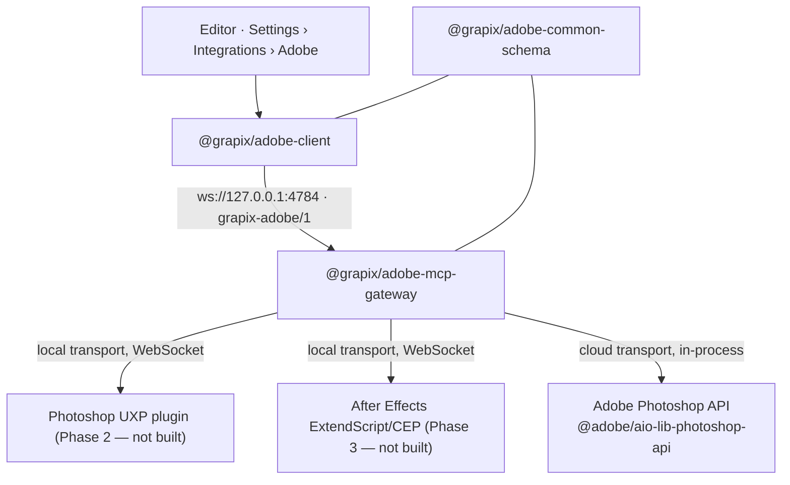

# Adobe integration (GrapiX v0.4 — Adobe Bridge)

Status: **Phase 1 (MCP Foundation) implemented and verified.** Phases 2–4 (the Photoshop
UXP plugin, the After Effects ExtendScript bridge, reliability depth) are not built.

Authority: this document sits under [`main-architecture.md`](main-architecture.md). Where
they disagree, that one wins.

## What exists



| Package | Domain | Role |
| --- | --- | --- |
| `@grapix/adobe-common-schema` | `Shared/adobe-common-schema` | The wire protocol, the shared `AdobeImportDocument`, and the Adobe object models transcribed from Adobe's own SDKs. |
| `@grapix/adobe-client` | `Shared/grapix-adobe-client` | Isomorphic client: the Editor panel runs it in the WebView, the integration tests run it in Node. |
| `@grapix/adobe-mcp-gateway` | `Editor/services/adobe-mcp-gateway` | The local gateway on port 4784. Routes tool calls, holds the cloud bridge, owns approval and the log ring. |
| Adobe panel | `Editor/apps/editor-web` | `File › Integrations · Adobe…` and `Project › Integrations · Adobe…`. |

Run it with `npm run dev:adobe`.

## Two transports, and why

| Transport | Reaches | Needs | Sees the open document |
| --- | --- | --- | --- |
| `local` | Photoshop, After Effects | A plugin running inside the application | Yes |
| `cloud` | Photoshop only | Adobe Photoshop API credentials | No — it works on a PSD by URL |

A call with no `transport` prefers `local` and falls back to `cloud`, the same precedence
the Figma importer uses for REST versus Desktop MCP. The reason to keep both is that a
playout machine has no Photoshop on it: the cloud transport is what makes "import from
Adobe" work there at all. The reason `local` wins by default is that only a plugin can see
the document the operator actually has open.

After Effects has no cloud API. Asking for `transport: "cloud"` on an `aftereffects.*`
tool is refused with `transport_unavailable` rather than quietly served by the local
bridge, because the two would return different things.

## Adobe SDKs

Both models are taken from Adobe's own SDKs rather than guessed.

### Photoshop — `@adobe/aio-lib-photoshop-api`

The library behind [`adobe/adobe-photoshop-api-sdk`](https://github.com/adobe/adobe-photoshop-api-sdk),
installed as a real dependency of the gateway. `Shared/adobe-common-schema/src/photoshop.ts`
mirrors its `LayerType`, `BlendMode`, `ParagraphAlignment`, `Storage`, `MimeType` and
`JobOutputStatus` vocabularies. Cloud manifests preserve the PSD layer hierarchy and editable
text metadata, while cloud pixel layers are PNG renditions rather than editable PSD pixels.
The import adds a flattened PNG preview and requests a PNG per pixel layer; a manifest thumbnail
is used only as a reported fallback when Adobe does not return that layer's rendition.

Cloud operations implemented: `getDocumentStructure` (`getDocumentManifest` plus import
renditions), `exportPreview` (`createRendition`), `updateTextLayer` (`modifyDocument`),
`replaceSmartObject`, `createDocument` and `importGrapixScene`.

Refused, each naming the missing capability rather than saying "unsupported":
`getActiveDocument` and `getSelectedLayers` (the API has no active document or selection),
`exportLayers` (it renders whole documents), `createLayer` (only as part of a document)
and `updateShapeLayer` (it cannot edit geometry).

Configure with credentials from an Adobe Developer Console project — all four or none, so
the panel never advertises a transport that fails on first use:

```text
GRAPIX_PS_API_CLIENT_ID
GRAPIX_PS_API_CLIENT_SECRET
GRAPIX_PS_API_ORG_ID
GRAPIX_PS_API_SCOPES     # optional; defaults to openid,AdobeID,read_organizations
```

### After Effects — After Effects SDK 25.6.61

`Shared/adobe-common-schema/src/afterEffects.ts` transcribes the AE object model from the
SDK headers, citing the header and line each value came from:

| Contract | Header |
| --- | --- |
| `AEGP_ObjectType` | `AE_GeneralPlug.h:982` |
| `AEGP_LayerStream` | `AE_GeneralPlug.h:1266` |
| `AEGP_KeyInterp` | `AE_GeneralPlug.h:1390` |
| `AEGP_StreamType` | `AE_GeneralPlug.h:1438` |
| `AEGP_TrackMatte` | `AE_GeneralPlug.h:920` |
| `AEGP_LayerFlags` | `AE_GeneralPlug.h:952` |
| `PF_MaskMode` | `AE_Effect.h:1917` |

It is transcribed rather than imported because the SDK is a C++ header set under Adobe's
licence and is not redistributable here. `vendor/adobe/` is gitignored and nothing in the
build reads it.

The numeric values are the wire contract an ExtendScript or AEGP bridge reports, so they
must match exactly: a bridge that sends `3` for a stream index and a schema that reads `3`
as a different property produces a scene that imports cleanly and animates the wrong
thing. Adobe's own rule keeps them stable — "only ever add to the end of the list, right
before `AEGP_LayerStream_NUMTYPES`" (`AE_GeneralPlug.h:1263`).

Two decisions worth knowing:

- `AEGP_LayerStream_ROTATION` and `_ROTATE_Z` are **one** index (`:1271`). Treating them as
  two streams would double-key Z rotation on every 3D layer.
- `PF_MaskMode_ACCUM` is deliberately **unmapped**. It is a real add rather than a screen,
  is not reachable from AE's UI, and has no GrapiX equivalent; aliasing it to `add` would
  render a different composite than AE and never say so.

## Compatibility handling

Every imported property resolves to `Native`, `Converted`, `Rasterised` or `Unsupported`,
and an unsupported feature never silently disappears.

The blend-mode path is the clearest case. Photoshop has 26 blend modes; GrapiX implements
six identically in both renderers (`IMPLEMENTED_BLEND_MODES`). Only exact equivalences are
mapped — `normal`, `darken`, `multiply`, `lighten`, `screen`, and Photoshop's
`linearDodge` to GrapiX's `add`. Everything else renders as `normal` **and** produces a
warning in the compatibility report, because aliasing `colorBurn` to `multiply` would put a
different picture on air than the designer approved.

Layer fidelity follows the same rule: `adjustmentLayer` is `Rasterised`, not `Converted`,
because GrapiX has no adjustment pipeline and the only honest import bakes pixels.

## Security

- **Loopback only** by default. `Origin` is checked on both the HTTP surface and the
  WebSocket upgrade; UXP and ExtendScript sockets send no `Origin` and are allowed.
- **Token on every connection**, compared with `timingSafeEqual`. A socket that has not
  said `hello` successfully within 10 s is closed.
- **Operator approval for every mutating tool.** `MUTATING_TOOLS` calls are refused with
  `approval_required` until the operator ticks the box in the panel. Approval is per
  gateway session and clears on reconnect. It applies to the cloud transport too: an
  unapproved edit never reaches Adobe.
- **Credentials never leave the gateway process.** They are read from the environment and
  are absent from the status payload, the log ring and the panel.
- **One bridge per (application, transport).** A second Photoshop plugin replaces the
  first, because two plugins driving one document would race on every mutating call.
- **Bounded frames and a bounded log.** 64 MiB per message, 500 entries in the ring, so a
  bridge reconnecting in a loop cannot grow the gateway's heap.
- No ExtendScript received over the wire is executed. Phase 3 will run fixed scripts only.

## Failure behaviour

| Failure | What the caller gets |
| --- | --- |
| Bad token | The socket is closed before `hello.ack`; `connect()` rejects. |
| Application not connected | `bridge_unavailable`, naming the application and transport. |
| Cloud transport unconfigured | `bridge_unavailable` listing the missing environment variables. |
| Mutating tool without approval | `approval_required`, and nothing reaches Adobe or the plugin. |
| Bridge dies mid-call | `bridge_disconnected` immediately, rather than a 60 s hang. |
| Bridge silent | `timeout` after 60 s. |
| Adobe job fails | `cloud_error` carrying Adobe's own status or message. |

## Verification

- `npm test -w @grapix/adobe-common-schema` — **16** tests: the SDK-transcribed models,
  the mask-mode and blend-mode mappings, and the fixture validator.
- `npm test -w @grapix/adobe-mcp-gateway` — **23** tests: token refusal, discovery,
  round-trip tool calls, progress, approval, transport precedence, bridge replacement,
  mid-call bridge death, the log ring, manifest conversion and every cloud refusal.
- `npm test -w @grapix/editor-web` — includes **8** tests for the panel's availability
  claims (`Connected` / `Cloud only` / `Disconnected` / `Unavailable`).

Smoke-tested against the running system: the gateway process on 4784, the panel driven in
a browser through connect → discover → live bridge attach → view logs → restart bridge →
approval toggle, and the real `@adobe/aio-lib-ims` path reaching Adobe (which rejected
deliberately invalid credentials with `invalid_client`, proving the SDK path is wired
rather than stubbed).

## After Effects modes and AEP Static Inspector

The earlier direct-project conversion work is historical parser research, not a shipped
project-import fidelity path. GrapiX has two non-interchangeable modes:

| Mode | Renderer | Boundary |
| --- | --- | --- |
| **AE Runtime Mode** | A locally installed After Effects runtime | Planned runtime boundary. It is the mode for rendering an AE project; it is not evidence that the adapter, frame bridge, output, or certification exists. |
| **GrapiX Native Mode** | The GrapiX wgpu renderer | It renders only an explicitly converted GrapiX scene and reports conversion compatibility. It does not render an `.aep` project or imply AE fidelity. |

The **AEP/AEPX Static Inspector** is the retained reader research boundary. It reads uploaded
project bytes and examines project structure for inspection and evidence only; it makes no renderability, fidelity, or
scene-conversion determination. The existing `POST /api/import/after-effects` inspection
endpoint remains reachable for that report. There is no browser `.aep` or `.aepx` upload and
no After Effects project-import command in the Editor.

### Historical parser evidence

An `.aep` is a RIFX file — RIFF with big-endian integers — whose form type is `Egg!`.
Adobe publishes no specification. The retained research reader uses `rifx.ts` for the
container, `aepParser.ts` for chunk semantics, and `cos.ts` for the PDF-style COS object
graph in the `btdk` chunk.

The corpus and its limitations are evidence, not a supported conversion matrix. Fixtures
verify some offsets against After-Effects-authored files; keyframes and masks have weaker,
synthetic evidence. The inspected fields include item and composition structure, layer
identity and timing, some transforms, masks, effects, markers, text documents and footage
paths. Missing or unestablished fields remain absent rather than being inferred.

The known format traps remain relevant to inspection:

- After Effects may omit a property that retains its default.
- `ldta` transfer-mode numbering is not blend-menu ordering.
- Adjustment layers also set the null bit.

### Compatibility reports

The historical converter labels observed features `native-editable`, `translated`, `sampled`,
`baked`, `missing-plugin`, `missing-asset`, or `unsupported`. Those labels are compatibility
research, not a promise that a scene renders like its AE source. Rendered-fallback baking is
not implemented; a `baked` label preserves and reports the issue rather than rasterising it.

### Planned runtime boundary

AE Runtime Mode is the planned route for an AE project's rendering. GrapiX Native Mode is a
separate, explicit conversion decision with a compatibility report. The GrapiX renderer
operates on GrapiX scenes; it does not render After Effects projects. Neither statement grants
the Editor Take, Program, or output authority.

## Not built yet

Phase 2 (Photoshop UXP plugin) and Phase 4 (connection recovery) remain. Rendered-fallback
baking for `baked` effects is not implemented.

The historical `.aepx` parser has not read an After Effects-authored project. It navigates an
invented `<Project><ItemList><Item><name>` PropertyList tree and its fixture repeats that shape;
a real `.aepx` serialises the RIFX chunk tree as 4CC elements with hex `bdata` payloads. That
finding is evidence for the AEP Static Inspector boundary, not an invitation to expose an
import path.
