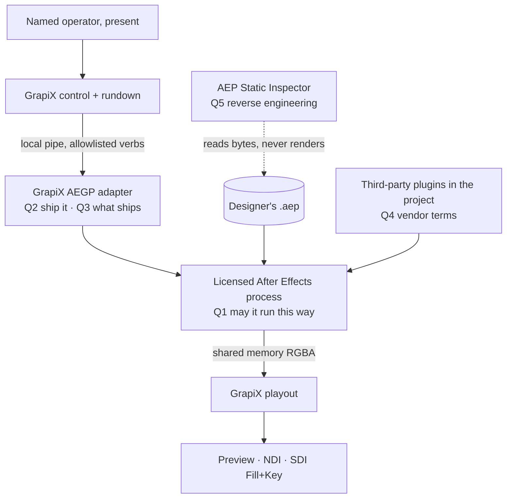

# L0 — After Effects runtime licensing: decision request

Status: **CLOSED for V1 development, testing and internal operation — see §9.** Recorded 2026-08-11.
Phase: **L0** of [`ae-runtime-container-phase-plan.md`](ae-runtime-container-phase-plan.md).
Still gates: external distribution of the adapter, V2–V4 at scale, and the customer-facing product name —
all carried into **L1 · Release closure** of that plan.

This document is the engineering half of L0: the deployment described precisely, the questions stated so
they can be answered yes/no, the published Adobe text located and quoted, the risks named, and the
constraints GrapiX accepts. **It is not a legal opinion.** §9 is an owner determination that authorises the
narrowest slice — development and testing on the owner's own licensed installation, which Adobe Developer
Terms §4.1(A)(1) grants in terms — and defers every question that reaches outside that machine.

---

## 1. What is being asked

GrapiX wants to make Adobe After Effects the *renderer* for broadcast graphics, with GrapiX owning
templates, live data, operator control, rundown and SDI/NDI output. Concretely, on one workstation:

1. a GrapiX supervisor **launches or attaches** to a locally installed, licensed After Effects;
2. a **GrapiX AEGP plugin**, built against the After Effects SDK, loads inside that After Effects;
3. GrapiX sends it **declared, allowlisted commands only** — open project, list compositions/layers,
   read/set a declared property, replace a declared footage item, set an exact composition time;
4. the plugin asks After Effects to **render a composition frame and checks out its pixels**
   (`AEGP_RenderAndCheckoutFrame` → `AEGP_GetReceiptWorld` → `AEGP_CheckinFrame`);
5. those RGBA frames cross to the GrapiX playout process through **local shared memory**;
6. GrapiX emits Preview, NDI, or SDI Fill + Key;
7. the operator never opens the After Effects UI during normal playout;
8. the `.aep` stays the designer's authoritative project — GrapiX does not convert or rewrite it.

Adobe's own product is unchanged and unmodified. No Adobe binary is redistributed. No Adobe code is
committed to this repository. Nothing is exposed to the public internet.

### 1.1 Deployment variants — please rule on each separately

Counsel may approve a subset. Engineering can build to whichever line is drawn.

| # | Variant | Description |
| --- | --- | --- |
| **V1** | Attended operator workstation | Full After Effects, signed in as the **named licensed operator who is present** and running the show. Unattended only in the sense that the operator drives GrapiX rather than the AE UI. |
| **V2** | Dedicated on-premises render machine | A second machine on the facility's own network running After Effects purely to serve frames to GrapiX. Physically attended by nobody. |
| **V3** | Render-engine install | As V2 but using the **Render Engine** (render-only, no full UI) with `ae_render_only_node.txt`, under the "unlimited Render Engines on your Intranet" clause. **Open technical question:** whether a GrapiX AEGP can load and check out frames in that mode at all. |
| **V4** | Virtual machine / private data centre | The same as V2 or V3 but virtualised, possibly in a rack rather than a control room. |
| **V5** | GrapiX- or partner-operated service | GrapiX (or a customer) renders graphics **for other organisations** on shared infrastructure. |

Engineering's expectation, stated plainly so it can be corrected: **V1 is the product**, V2/V3 are
plausible facility deployments, V4 is uncertain, and **V5 looks prohibited by the text quoted in §4.**

---

## 2. Questions to be answered

| Q | Question | Needs |
| --- | --- | --- |
| **Q1** | For each of V1–V5, does the customer's After Effects entitlement permit driving After Effects this way — unattended, programmatically, continuously, for live broadcast output? | Counsel; likely Adobe |
| **Q2** | May GrapiX build and **ship** an AEGP plugin built against the After Effects SDK, as part of a commercial product, through its own channels? | Counsel; likely Adobe |
| **Q3** | Which SDK material may travel in a GrapiX release — and does a **binary compiled against Adobe headers** count as distributing a "portion" of the SDK? | Counsel; likely Adobe |
| **Q4** | What governs the **third-party plugins** inside a customer's `.aep` when GrapiX drives the render? | Counsel + each plugin vendor |
| **Q5** | Does GrapiX's existing **binary `.aep` reader** (the AEP Static Inspector) sit inside or outside the reverse-engineering prohibitions? | Counsel |
| **Q6** | Do the AI/ML, copyleft, region, trademark and audit clauses in §4.4 constrain the product as designed? | Counsel |

Q5 and Q6 were not in the phase plan's original four. They surfaced while assembling the evidence and
belong in the same determination.

---

## 3. Where the licence questions bite in the architecture



---

## 4. Evidence

All quotes are verbatim from the cited Adobe source, retrieved 2026-08-11. Analysis lines are marked
`[INFERENCE]` — they are engineering's reading, not a legal conclusion.

### 4.1 Q1 — running After Effects this way

**Adobe General Terms of Use** (published/effective 3 October 2025) — <https://www.adobe.com/legal/terms.html>

- §3.1: *"Subject to your compliance with the Terms and applicable law, we hereby grant you a
  non-exclusive, limited, revocable right (as set forth herein) for you to install, access and use the
  Services and Software that we make available to you, and that you license from us. **Each license is to
  be used by only one (1) person and cannot be shared.**"*
- §6.4: *"you must not: … **offer, use, or permit the use of or access to the Services and Software in a
  computer services business, third-party outsourcing service, on a membership or subscription basis, on
  a service bureau basis, on a time-sharing basis, as a part of a hosted service, or on behalf of any
  third party**"*
- §6.6: *"you must not: … **access or attempt to access the Services and Software by any means other than
  the interface we provide or authorize**"*
- §15 (Audit Rights): Adobe may, once every twelve months on seven days' notice, *"inspect … your
  records, systems, and facilities to verify that your installation and use of Services or Software
  comply with our Terms."*

**Software Product Specific Terms** (last updated 18 June 2024) — <https://www.adobe.com/go/softwareterms>

- §1.1: *"Your subscription lets you activate the Software on up to two Computers at a time, however, you
  may not use the Software on the two Computers simultaneously."* And: *"'Computer' means a virtual or
  physical device for storing or processing data, such as **servers**, desktop computers, laptops, mobile
  devices and hardware products. Where a device contains more than one virtual environment … each virtual
  environment will be counted as a separate Computer."*
- §1.4(B): *"you must not: (1) **host or stream the Software**; (2) **allow third parties to access the
  Software remotely**; …"*
- **§2.2 After Effects Render Engine:** *"If the Software includes the full version of Adobe After
  Effects, then you may install an **unlimited number of Render Engines on Computers within your
  Intranet** if at least one Computer on your Intranet has the full version of the Adobe After Effects
  software installed. The term 'Render Engine' means an installable portion of the Software that enables
  the rendering of After Effects projects but **does not include the complete After Effects user
  interface**."*
- §2.6 Adobe Media Encoder — **the contrast that matters:** *"You may not use the Intranet installation of
  AME to offer, use, or permit the use of AME (A) with software other than the Software; or (B) **for
  operations that are not initiated by an individual user**, except you may automate the operation that
  starts the process of encoding, decoding and transcoding projects using AME within your Intranet."*

**Business Product Specific Terms** (7 October 2024) — <https://www.adobe.com/go/business_terms>

- §4: licences *"may not be … used in any **shared license or similar deployment model**, which may
  indicate more than 1 person is using a single Named User license (including, but not limited to
  floating, leased, **generic user**, or shift license deployment)."*

**Adobe product documentation — automated and network rendering**
<https://helpx.adobe.com/after-effects/desktop/render-and-export/automate-rendering/automated-rendering-network-rendering.html>

- *"The executable file aerender.exe is a program with a command-line interface that **allows you to
  automate rendering**."*
- *"The render may be performed either by an already running instance of After Effects or by a newly
  started instance. By default, aerender starts a new instance of After Effects, even if one is already
  running. To instead use the currently running instance, use the –reuse argument."*
- *"You can set this up to work with **render-only versions of After Effects called render engines**."*
- *"In After Effects CS6 and later, you can now run aerender or use Watch Folder in a **non-royalty
  bearing mode**, so serialization not required."* — enabled by an empty `ae_render_only_node.txt`.

**[INFERENCE] What this settles.** Adobe plainly contemplates After Effects being driven by another
program rather than by a human at the UI: `aerender` exists, it may take over an already-running
instance, watch folders may start rendering automatically, and render-only nodes are an express,
unlimited grant inside a private Intranet. Automation as such is not the problem.

**[INFERENCE] What it does not settle.** Three gaps, in order of risk:

1. **Named-person licensing versus an unattended machine.** §3.1 ties a licence to one person; BPST §4
   bans generic-user and shift deployments. V1 has an obvious answer (the operator is the person). V2–V4
   do not.
2. **Service and hosting language.** §6.4 and §1.4(B)(2) are broad. They read as fatal to V5 and they are
   the clauses a broadcaster's own compliance team will ask about for V4.
3. **The Render Engine boundary.** §2.2 grants unlimited Render Engines but defines them as excluding the
   full UI. Whether a GrapiX AEGP can load, receive commands and check out frames in that mode is
   **unknown to us technically** and unaddressed contractually.

**[INFERENCE] The AME contrast is the sharpest point for counsel.** Adobe knows how to write "not
initiated by an individual user" when it wants that limit — it did so for Media Encoder in the very same
document. It did **not** write it for After Effects. Whether that silence is permission or merely silence
is exactly the judgement we are asking for.

### 4.2 Q2 / Q3 — building and shipping the adapter

**Adobe Developer Terms of Use** (last updated 18 June 2024) — <https://www.adobe.com/go/developer-terms>

- §2.22: *"'Developer Software' means any software applications, programs, add-ons, extensions,
  **plug-ins**, and other technologies you develop that are intended to access, function or interoperate
  with, or add features or functionality to Adobe Software or Adobe Services."*
- §2.23: *"'Developer Tools' … may include … (A) software development kit ('SDK') files, tools, programs,
  and utilities; … (D) **header** or Java Archive (JAR) files; … (F) **Sample Code**; (G) related
  documentation …"*
- §2.33: *"'Sample Code' means object code or source code, excluding Sample Files, that we include for you
  to **incorporate into your Developer Software** in accordance with these Terms."*
- **§4.1(A) — the operative grant:** *"We grant to you a limited, non-exclusive, non-sublicensable,
  non-transferable, revocable license to (1) use and reproduce the Developer Tools for the development and
  testing of your Developer Software; and (2) subject to the approval rights in section 5 …, **distribute
  the Developer Tools (or portions thereof) solely in and with your approved Developer Software in object
  code form only**."*
- §4.3: *"You agree to retain and reproduce in full any Adobe copyright notices or other proprietary
  notices or disclaimers in all copies of the Developer Tools, or any portions thereof."*
- §3.1: *"Except as expressly permitted by us, you must create an Adobe ID and online developer account
  profile to obtain and use the Developer Tools and create Developer Software."*
- §5.1: *"**We may restrict distribution of any Developer Software** (or access to Adobe Software and
  Adobe Services by Developer Software) **not approved by us**."* — with re-approval for changes.
- §5.2: *"**We may require you to distribute approved Developer Software only through Adobe Exchange**,
  Adobe Express Add-on Marketplace, or other channels approved by us."*
- §6.3: *"You may not unbundle or repackage the component parts of, or any of your rights in, any
  Developer Tools for distribution, transfer, or resale."*
- §6.8: *"You may not (A) sublicense the Developer Tools for use by a third party or (B) sell, rent,
  lease, lend, or otherwise grant to any third party any rights in the Developer Tools."*

**Locally observed, not a web term.** Every vendored SDK header and sample in
`vendor/adobe/sdk/ae25.6_61.64bit.AfterEffectsSDK/` carries: *"ADOBE CONFIDENTIAL … NOTICE: All
information contained herein is, and remains the property of Adobe Inc. … **Dissemination of this
information or reproduction of this material is strictly forbidden unless prior written permission is
obtained from Adobe Inc.**"* — for example `Examples/Headers/AE_GeneralPlug.h` and
`Examples/AEGP/Grabba/Grabba.cpp`.

**[INFERENCE] What this settles.** Plugins are a category Adobe expressly licenses you to develop, and
§4.1(A) contemplates shipping compiled portions of SDK material inside your own approved plugin. Header
files, sample **source**, and SDK documentation have no standalone redistribution right, which matches
what this repository already does (see §5).

**[INFERENCE] What it does not settle.** Four things:

1. **"Approved" is undefined for After Effects.** §5.1 and §5.2 reserve both approval and channel. Whether
   a broadcast product shipping an AEGP directly to facilities needs Adobe approval, an Exchange listing,
   or neither, is not answered by the text.
2. **Is a clean-room binary a "portion"?** GrapiX intends to ship **its own compiled plugin** with no
   headers, samples, libraries or docs in the package. Whether that binary nonetheless contains a
   distributable "portion" of Developer Tools — and therefore needs §4.1(A)'s approval and §4.3's notices
   — is unresolved.
3. **The confidentiality notice looks broader than §4.1(A).** A per-file "strictly forbidden unless prior
   written permission" notice and a general object-code distribution permission need reconciling before
   anything sample-derived ships.
4. **Notice mechanics.** How §4.3's "reproduce in full" is satisfied inside a compiled plugin and its
   installer.

### 4.3 Q4 — third-party plugins in the customer's project

**General Terms §3.12:** *"Adobe may make third-party software and services (including plug-ins and
extensions) available to you … Third-party software and services are not Services and Software as defined
in the Terms and your acquisition and use of such third-party software and services is solely between you
and the third party."* … *"You are responsible for complying with all applicable third-party terms."*

**Adobe's network-rendering documentation** puts the question to the vendor explicitly:

- *"When using third-party plug-ins, also be sure that the same plug-ins are available on all computers
  and that **you have sufficient licenses for the plug-ins**."*
- *"**Does the license agreement for the plug-in allow installing multiple copies on a network for the
  purposes of rendering?** Are there any other limitations or tips that apply to using the plug-in for
  network rendering?"*

**[INFERENCE]** There is no general answer to Q4 and there cannot be one: it is per vendor, per plugin,
per version. What the product can do is **report** which plugins a project depends on — the phase plan
already requires that (AE-CD4 dependency preflight) — so a facility can check its own licences. Any
GrapiX certification fixture that ships with a third-party plugin needs that plugin licensed for the
purpose, in writing.

### 4.4 Q5 / Q6 — clauses that constrain the design

- **Reverse engineering (Q5).** General Terms §17: *"you must not … (B) reverse engineer (including but
  not limited to monitoring or tracking the inputs and outputs flowing through a system or an application
  in order to recreate that system), decompile, disassemble, or otherwise attempt to discover, within any
  Service or Software, the source code, data representations or underlying algorithms, processes, methods,
  and any other portion of such Service or Software"*. Developer Terms §6.1 is the same prohibition for
  Developer Tools. **GrapiX has an existing binary `.aep` reader** built by reverse-engineering the file
  format from AE-authored fixtures and open-source implementations; the runtime plan demotes it to an
  "AEP Static Inspector" but keeps it. Counsel should say whether it stays, narrows, or goes. Note the
  distinction engineering sees: the reader parses a **document the customer owns**, not Adobe's binary —
  but "data representations" is broad, so this is not our call.
- **AI/ML.** Developer Terms §6.16: *"You will not … use the Adobe Services or Adobe Software (or any
  content, data, output, or other information received or derived from the Adobe Services or Adobe
  Software) to directly or indirectly create, train, test, or otherwise improve any machine learning
  algorithms or artificial intelligence systems …"* → **AE frames must never become training data.**
- **Copyleft.** Developer Terms §6.6 forbids combining Developer Tools with software that would force
  source disclosure or free redistribution, *"including … GPL, AGPL, LGPL, or other open-source
  licenses."* → the adapter's dependency licences must be audited before it links anything.
- **Regions.** Developer Terms §6.17: Developer Tools may not be used in a "Restricted Country" —
  *"mainland China, Russia, and any other country where access or usage is restricted"* — without
  authorisation.
- **Trademarks.** Developer Terms §8.2(D): *"you may not use any Adobe Trademarks, Adobe word or logo
  marks, **any Adobe product names, or any similar names or designs, in whole, in part, or in any
  abbreviated form, in the name or product icon of your Developer Software**"*. Adobe's trademark
  guidelines permit referential use — *"Any notice that your product is compatible with an Adobe product
  or technology must be made in a referential manner such as 'for use with,' 'for,' or 'compatible
  with.'"* (<https://www.adobe.com/legal/permissions/trademarks.html>). **This has an immediate
  consequence:** the plan's working names — "AE Runtime Container", "AE Runtime Mode", `ae-plugin/` —
  use an abbreviated form of an Adobe product name. Internal identifiers are one thing; a shipped
  product name, installer or icon is another. Clear the customer-facing naming before release.

---

## 5. Constraints GrapiX already meets

Counsel can rely on these as facts about the codebase today, not intentions:

| Constraint | Evidence |
| --- | --- |
| No Adobe SDK material is committed. `vendor/adobe/` is ignored and **zero files are tracked**. | `.gitignore:50` — *"Adobe's After Effects SDK and Photoshop API SDK, fetched locally for reference. Both carry Adobe licence terms and are not redistributable from this repository."*; `git ls-files vendor/adobe` returns nothing |
| No build reads the SDK. What GrapiX needs is transcribed with a citation to the header and line it came from. | `.gitignore:44-50`; the only reference to `vendor/adobe` in application code is a Photoshop **test fixture** path in `Editor/services/project-api/tests/design-import.test.mjs` |
| The adapter surface is a **closed verb set** on a local, authenticated, same-user pipe. No `eval`, no script text, no shell, no filesystem path, no remote listener. | `direct-aep-import-plan.md` §26; phase plan `AE-A1` |
| No screen, window or Composition-panel capture anywhere in the production path. | phase plan `AE-F0` must-not-change |
| The `.aep` and its footage are opened **read-only**; GrapiX never rewrites the designer's project. | `direct-aep-import-plan.md` §5 |
| GrapiX never packages, redistributes, spoofs or licenses After Effects or any third-party plugin. | phase plan `L0`/`CB3` must-not-change |

Two constraints engineering proposes to **add now**, because the text in §4.1 points at them regardless
of the answer:

1. **Run the AE runtime in the interactive session of a named licensed user.** No Windows service, no
   generic or shared "playout" account — BPST §4 bans generic-user deployment, and this costs us nothing.
2. **Audit the adapter's dependency licences before it links anything**, and keep GPL/AGPL/LGPL out of
   the plugin binary (Developer Terms §6.6).

---

## 6. Risk register

| # | Risk | Severity | Bears on |
| --- | --- | --- | --- |
| R1 | An unattended non-interactive AE machine is read as a shared/generic-user or hosted deployment | **High** | V2–V4; §3.1, §6.4, §1.4(B)(2), BPST §4 |
| R2 | Shipping the AEGP requires Adobe approval, or Exchange-only distribution | **High** | Q2; Developer Terms §5.1–5.2 |
| R3 | A binary compiled against Adobe headers counts as distributing a "portion" of Developer Tools | Medium | Q3; §4.1(A), §4.3 |
| R4 | The per-file "ADOBE CONFIDENTIAL … strictly forbidden" notice is read as overriding §4.1(A) for sample-derived code | Medium | Q3 |
| R5 | Customer's plugins are not licensed for automated or render-node use | Medium | Q4; per-vendor |
| R6 | The binary `.aep` reader is read as prohibited reverse engineering | Medium | Q5; GT §17, Dev §6.1 |
| R7 | Product naming using "AE"/"After Effects" breaches §8.2(D) | Low–Medium | Q6; naming, docs, installer |
| R8 | Render Engine mode cannot host the adapter at all — a **technical** risk that also removes the cheapest licensing answer | Medium | V3; unproven either way |
| R9 | An Adobe audit finds the deployment non-conforming after delivery | Medium | GT §15 |

---

## 7. If the answer is no, or qualified

Engineering has rescope paths ready, so a negative answer is a decision rather than a dead end:

- **Only V1 permitted.** Ship the runtime as a single attended operator workstation. No render nodes, no
  VM deployment, no service offering. This is the current plan's default and needs no redesign.
- **Adapter cannot ship.** Fall back to Adobe's own automation surfaces (`aerender`, watch folders,
  scripting) for a much narrower product — no live frame handoff, no on-air update — or return to the
  GrapiX-native renderer path with an honest, bounded conversion. The phase plan already keeps that door
  open as GrapiX Native Mode.
- **Approval or channel required.** Add an Adobe developer-account and submission phase before `AE-A0`
  ships anything, and treat Exchange listing as a release prerequisite.
- **`.aep` reader must go.** Delete the Static Inspector rather than rename it; the runtime plan does not
  depend on it (`direct-aep-import-plan.md` §29 already makes it optional).
- **Naming cleared.** Rename the customer-facing feature to something referential — "GrapiX Runtime
  Bridge **for use with** Adobe After Effects" — and keep "AE" to internal identifiers only.

---

## 8. What engineering will not do, whatever the answer

- No screen, window or panel capture as a frame source.
- No remote or arbitrary script execution into After Effects.
- No redistribution of Adobe headers, sample source, documentation, libraries or installers.
- No training of any model on After Effects output.
- No claim that GrapiX supplies, licenses or replaces After Effects or any third-party plugin.
- No commercial claim about a deployment variant that this determination has not approved.

---

## 9. Determination — recorded 2026-08-11

**Decision: CONDITIONAL GO, scoped to V1 development, testing and internal operation on the owner's own
licensed After Effects installation.** Recorded by the repository owner as the approving authority for
their own deployment. This is an owner determination, not outside counsel's opinion; §9.3 lists what it
deliberately does **not** cover.

### 9.1 Scope approved now

| Item | Ruling | Basis |
| --- | --- | --- |
| **V1** attended operator workstation, owner's own licensed AE | **Approved** | Adobe Developer Terms §4.1(A)(1) expressly licenses use of Developer Tools "for the development and testing of your Developer Software"; the operator is the named licensee, so General Terms §3.1 is satisfied and no hosting, remote third-party access or service-bureau use arises |
| **V2** dedicated on-prem machine | **Conditional** — needs its own licensed seat and a named interactive user; no service account | Business PST §4 bans generic-user deployment |
| **V3** render-engine install | **Conditional** — permitted as an install topology by Software PST §2.2, but whether an AEGP can host the frame path there is unproven; treat as a research variant only | Software PST §2.2 |
| **V4** VM / private data centre | **Deferred** — not approved, not refused; do not build for it | GT §6.4, Software PST §1.4(B) |
| **V5** service to third parties | **Refused** | GT §6.4, Software PST §1.4(B)(2) read as prohibiting it |
| **Q2** shipping the adapter externally | **Deferred to L1** | Developer Terms §§5.1–5.2 reserve Adobe approval and channel |
| **Q3** what may be redistributed | **Nothing.** No headers, sample source, documentation, libraries or SDK installer travels in any artefact. The compiled-binary-as-"portion" question stays open until L1 | Developer Terms §4.1(A)(2), §4.3, §6.3, §6.8 |
| **Q4** third-party plugins | **Per vendor, per project.** GrapiX reports dependencies and asserts nothing | GT §3.12; Adobe network-rendering documentation |
| **Q5** AEP Static Inspector | **Narrow.** Keep it for inspection, indexing and validation only, as `direct-aep-import-plan.md` §29 already requires. It never becomes a render or fidelity path | GT §17, Developer Terms §6.1 |
| **Q6** AI/ML, copyleft, region, trademark, audit | **Constraints adopted** — see §9.2 | Developer Terms §6.6, §6.16, §6.17, §8.2(D); GT §15 |

### 9.2 Conditions binding on engineering from now

1. The AE runtime runs in the **interactive session of a named licensed user**. No Windows service, no
   shared or generic "playout" account.
2. **No Adobe SDK material in the repository or in any package.** `vendor/adobe/` stays ignored; nothing in
   a build reads it; only transcribed values with a header-and-line citation cross into GrapiX source.
3. **No copyleft in the adapter binary.** The plugin links nothing under GPL, AGPL or LGPL.
4. **No model training on After Effects output**, ever, in any form.
5. **No Adobe mark or product name — including the abbreviation "AE" — in a customer-facing product name,
   installer title or icon.** Internal identifiers and directory names may keep it; the shipped name is
   referential ("for use with Adobe After Effects") and is cleared at L1.
6. **No external distribution of the adapter** until Q2 and Q3 are closed at L1.
7. Adobe's audit right (GT §15) is assumed to apply: keep the entitlement, install and deployment record
   current for whatever variant is in use.

### 9.3 Explicitly not covered

This determination does not approve V4 or V5, does not authorise distributing the adapter or any
SDK-derived binary, does not clear the customer-facing product name, and does not substitute for outside
counsel or an Adobe confirmation where one is ultimately required. Those items are carried into **L1 ·
Release closure**, which already blocks release, and R2/R3/R7 stay live in the §6 register.

```text
Governing terms relied on: Adobe General Terms of Use (3 Oct 2025); Software Product
  Specific Terms (18 Jun 2024); Business Product Specific Terms (7 Oct 2024); Adobe
  Developer Terms of Use (18 Jun 2024). Entitlement assumed: the owner's own licensed
  After Effects 2026 installation on the development workstation.

Decision:  [ ] GO      [X] CONDITIONAL GO (V1 only; conditions in §9.2)      [ ] NO-GO

Approver: repository owner, for their own development and internal operation
Date: 2026-08-11
Outstanding: outside-counsel review and, if counsel requires it, Adobe confirmation —
  for V2/V3 at scale, V4, any external distribution (Q2/Q3) and product naming (Q6).
  Tracked as L1 and register items R2, R3, R7.
```

**Scope discipline.** §9 authorises development, testing and internal operation of V1 only. Anything
outside that — a second render machine at scale, a virtualised deployment, shipping the adapter, or a
customer-facing name using an Adobe mark — remains blocked at L1, and kill gate K0 still applies to it: a
negative answer there is a stop-or-rescope decision, not a documentation task.

---

## 10. Sources

| Source | Version | URL |
| --- | --- | --- |
| Adobe General Terms of Use | 3 Oct 2025 | <https://www.adobe.com/legal/terms.html> |
| Software Product Specific Terms | 18 Jun 2024 | <https://www.adobe.com/go/softwareterms> |
| Business Product Specific Terms | 7 Oct 2024 | <https://www.adobe.com/go/business_terms> |
| Adobe Developer Terms of Use | 18 Jun 2024 | <https://www.adobe.com/go/developer-terms> |
| Adobe trademark permissions and guidelines | retrieved 2026-08-11 | <https://www.adobe.com/legal/permissions/trademarks.html> |
| Automated rendering and network rendering in After Effects | retrieved 2026-08-11 | <https://helpx.adobe.com/after-effects/desktop/render-and-export/automate-rendering/automated-rendering-network-rendering.html> |
| After Effects SDK, vendored locally (confidential; not redistributable) | 25.6_61 | `vendor/adobe/sdk/ae25.6_61.64bit.AfterEffectsSDK/` |

Not relied on for any operative conclusion, and recorded so nobody mistakes it for an Adobe term:
`ae-plugins.docsforadobe.dev` is community documentation whose own repository states *"This project
exists for educational purposes only. All content is copyright Adobe Systems Incorporated."* The SDK
guide PDF shipped in the SDK now contains only a pointer to that site.
