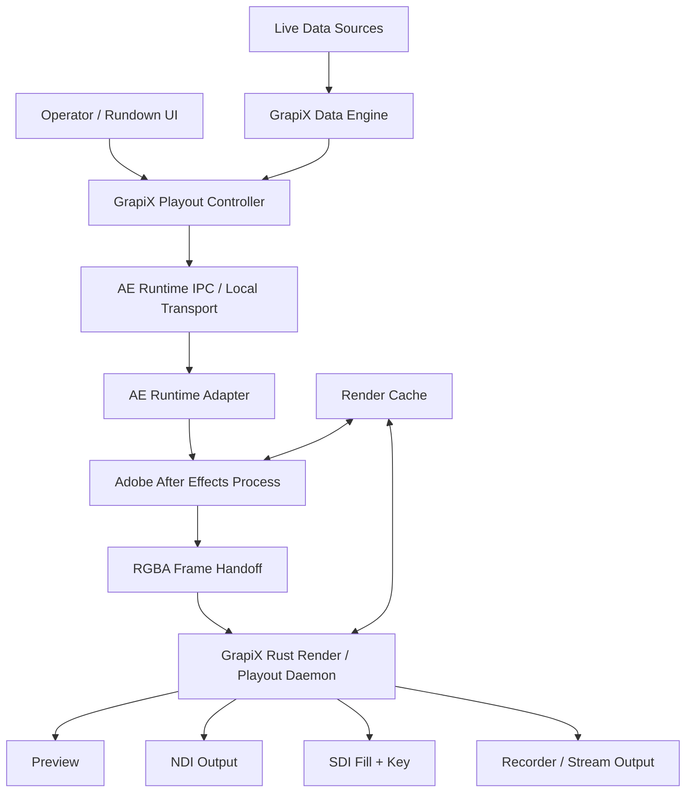

# After Effects Runtime Container and Live Broadcast Control Plan

Status: **new primary architecture, 2026-08-11**  
Supersedes: **direct binary `.aep` import as the primary product path**  
Primary goal: **author in After Effects, operate dynamically from GrapiX, render with the real After Effects engine, output through GrapiX**  
Runtime dependency for full-fidelity AE mode: **licensed Adobe After Effects installation**  
Primary source format: **native `.aep` project**

---

## 1. Product decision

The primary After Effects integration is no longer a converter whose job is to recreate an After Effects project inside the GrapiX renderer.

The primary product is an **After Effects Runtime Container** controlled by GrapiX.

The user workflow is:

1. the designer creates and animates the graphic normally in Adobe After Effects;
2. the `.aep` remains the authoritative project;
3. GrapiX attaches the project to an **AE Runtime Container**;
4. the designer exposes selected AE layers/properties as dynamic GrapiX controls;
5. GrapiX binds those controls to manual values, APIs, databases, sports feeds, WebSockets, files, automation, or other data sources;
6. GrapiX sends updates and playout commands to the running AE runtime;
7. After Effects evaluates the original project, expressions, fonts, effects, plugins, masks, mattes, 3D, motion blur, and keyframes;
8. the resulting RGBA frames are delivered to the GrapiX playout/output layer;
9. GrapiX publishes Preview, NDI, SDI Fill + Key, recording, or other supported output.

The core principle is:

> **After Effects is the authoring and visual render engine. GrapiX is the template, data, automation, control, rundown, and broadcast-output engine.**

This architecture is intentionally closer to an **After Effects-powered XPression/Viz-style graphics workflow** than to a file importer.

---

## 2. Why the previous direct `.aep` plan is no longer the primary path

The previous plan correctly established that binary `.aep` project bytes can expose structure and stored values but do not contain an executable copy of the After Effects rendering environment.

A direct parser cannot provide complete fidelity for:

- After Effects effects;
- third-party plugins;
- expression evaluation;
- text shaping and font behaviour;
- 3D renderer behaviour;
- motion blur;
- frame blending;
- color-management behaviour;
- plugin-specific rendering;
- renderer-version-specific output.

Therefore the native parser remains useful only for optional inspection, indexing, validation, metadata extraction, and a future GrapiX-native conversion workflow.

It is **not** the primary route for running an AE-authored broadcast graphic.

### New decision

- **GO:** AE Runtime Container using the actual After Effects installation.
- **GO:** GrapiX live data/control layer over exposed AE properties.
- **GO:** GrapiX playout/rundown semantics around an AE project.
- **GO:** direct RGBA frame handoff from AE to GrapiX if SDK validation proves the required frame access path.
- **GO:** NDI and SDI Fill + Key from GrapiX after frame handoff.
- **GO:** caching/pre-render strategies for expensive non-dynamic portions.
- **DEFER:** independent pixel-faithful After Effects renderer in GrapiX.
- **DEFER:** arbitrary `.aep` binary conversion as the production fidelity path.

---

## 3. Target user experience

### 3.1 Designer workflow

The designer works normally in After Effects.

Example project:

```text
PLAYER_LOWER_THIRD
├─ CTRL
├─ PLAYER_NAME
├─ TEAM_NAME
├─ SCORE
├─ PLAYER_IMAGE
├─ TEAM_COLOR
├─ BACKGROUND
├─ LIGHT_SWEEP
├─ PARTICLES
├─ GLOW
└─ OUT_ANIMATION
```

The designer then opens GrapiX and creates an AE Runtime Container from the `.aep`.

GrapiX discovers the project/compositions through the AE runtime adapter and shows the composition tree.

The designer selects properties to expose:

```text
PLAYER_NAME.Source Text       → Text
TEAM_NAME.Source Text         → Text
SCORE.Source Text             → Number/Text
PLAYER_IMAGE.Source           → Image
TEAM_COLOR.Fill.Color         → Color
LOGO_LAYER.Opacity            → Number
SPONSOR_LAYER.Enabled         → Boolean
BAR.Scale                     → Number/Vector
```

GrapiX creates an operator-facing template from those controls.

### 3.2 Operator workflow

The operator should not need to work inside the AE interface.

Example GrapiX template controls:

```text
Player Name       [ VAMSI              ]
Team              [ TESSERACT          ]
Score             [ 12                 ]
Player Image      [ player01.png       ]
Team Color        [ #FF301F            ]
Sponsor           [ ON                 ]

[ CUE ] [ TAKE ] [ UPDATE ] [ CONTINUE ] [ OUT ]
```

The same fields may also be controlled from live data.

---

## 4. System architecture



The system is split into six owned layers:

1. **GrapiX Editor/Template layer**
2. **GrapiX Data Engine**
3. **GrapiX Playout Controller**
4. **AE Runtime Adapter**
5. **AE Frame Bridge**
6. **GrapiX Broadcast Output**

After Effects remains an external licensed runtime process; GrapiX does not claim to redistribute or reimplement Adobe's engine.

---

## 5. AE Runtime Container

An AE Runtime Container is a GrapiX project object that references one `.aep`, one runtime profile, one selected composition set, one dynamic-property manifest, and one output configuration.

Suggested contract:

```ts
interface AeRuntimeContainer {
  id: string;
  name: string;
  projectUri: string;
  projectDigest: string;
  aeRuntimeProfile: AeRuntimeProfile;
  compositions: AeRuntimeComposition[];
  controls: AeDynamicControl[];
  cues: AeCueDefinition[];
  bindings: AeDataBinding[];
  outputProfileId: string;
  cachePolicy: AeCachePolicy;
  status: AeRuntimeStatus;
}
```

The project file remains authoritative.

GrapiX stores runtime metadata and bindings separately so the designer can continue editing the `.aep` without converting the entire project into GrapiX objects.

---

## 6. AE Runtime Adapter

The adapter is the controlled integration layer between GrapiX and the running After Effects process.

It must support at least:

- launch or attach to a compatible AE runtime;
- open project;
- close project;
- list project items;
- list compositions;
- list layers;
- list supported properties;
- read current property values;
- set property values;
- replace selected footage/source where supported;
- read expressions and property metadata;
- detect installed effects/plugins where the AE runtime exposes them;
- set composition time;
- request/evaluate a frame;
- report render completion/failure;
- expose AE version/build and environment fingerprint;
- produce structured diagnostics;
- never allow arbitrary untrusted script execution from a remote client.

### 6.1 Integration technology

Use the smallest combination necessary from the supported After Effects extension surfaces:

- native After Effects C/C++ SDK component for performance-critical frame/runtime integration;
- controlled scripting/DOM adapter for project/layer/property discovery and mutations where appropriate;
- optional panel only for development/debugging or designer-side setup;
- local authenticated IPC between GrapiX and the AE-side component.

Do **not** use a free-form general-purpose scripting endpoint exposed to the network.

### 6.2 Process ownership

AE should run as a managed runtime owned by the local GrapiX workstation session.

```text
GrapiX Session
   └─ AE Runtime Supervisor
       └─ AfterFX process
           └─ GrapiX AE adapter/plugin
```

The supervisor tracks:

- PID;
- AE version/build;
- project loaded;
- active composition;
- runtime health;
- render latency;
- last frame id;
- last data revision;
- crash/restart state.

---

## 7. Dynamic control manifest

Dynamic controls must be explicit.

Do not make every AE property remotely mutable by default.

Example:

```ts
interface AeDynamicControl {
  id: string;
  displayName: string;
  compositionId: string;
  layerRef: AeLayerRef;
  propertyPath: AePropertyRef[];
  kind:
    | "text"
    | "number"
    | "boolean"
    | "color"
    | "point2d"
    | "point3d"
    | "image"
    | "video"
    | "enum";
  writable: boolean;
  updatePolicy: "immediate" | "next-frame" | "on-take" | "on-cue";
  validation?: AeControlValidation;
}
```

Each control has a stable GrapiX id independent of the operator-visible layer name.

Layer names are not sufficient identity because designers may rename or duplicate them.

The adapter should preserve AE-side identifiers/property paths plus a GrapiX-generated stable binding id.

---

## 8. Data binding engine

The AE Runtime Container uses the existing/general GrapiX data engine rather than creating a separate AE-specific data system.

Supported source classes should include:

- manual operator values;
- JSON;
- REST API;
- WebSocket;
- SQL/database connector;
- CSV;
- Google Sheets or equivalent connector when implemented;
- esports tournament/game APIs;
- timers/clocks;
- internal GrapiX variables;
- MCP/automation inputs;
- calculated/transformed values.

Example binding:

```text
Sports API
   ↓
match.home.players[0].nickname
   ↓
GrapiX field: player.name
   ↓
AE control: PLAYER_NAME.Source Text
```

### 8.1 Data revisions

Every batch of data has a revision id.

```ts
interface AeRuntimeDataUpdate {
  containerId: string;
  revision: number;
  timestampNs: string;
  values: Record<string, unknown>;
}
```

AE should apply a complete revision atomically where possible so different fields do not appear from different game states in the same output frame.

---

## 9. Runtime property updates

Updates are classified by cost and behaviour.

### 9.1 Fast dynamic properties

Expected common live-control targets:

- source text;
- numeric slider/control values;
- color values;
- opacity;
- visibility/enabled state;
- position/scale/rotation values;
- image source replacement;
- selected effect parameters;
- expression-control values;
- checkbox/menu controls.

### 9.2 Expensive or disruptive updates

Handle carefully:

- changing project structure;
- adding/deleting layers;
- changing renderer;
- changing comp resolution;
- changing heavy effect/plugin topology;
- loading very large media;
- changing fonts;
- rebuilding expressions;
- replacing deeply referenced precomp sources.

These may require a cue/preload state rather than immediate on-air mutation.

---

## 10. Template authoring convention

Provide an optional GrapiX AE authoring convention to make projects easier to expose without limiting normal AE work.

Recommended methods:

### Method A — Explicit GrapiX Controls

Designer marks supported properties through a GrapiX setup panel or control effect.

Example:

```text
GRAPIX_CONTROLS
├─ PLAYER_NAME
├─ SCORE
├─ TEAM_COLOR
└─ SHOW_SPONSOR
```

### Method B — Existing AE expression controls

Where suitable, GrapiX binds to existing:

- Slider Control;
- Color Control;
- Checkbox Control;
- Point Control;
- Dropdown/Menu controls.

This can keep complex expressions inside the `.aep` while GrapiX only updates a small set of safe controls.

Example:

```text
GrapiX SCORE = 12
        ↓
AE Slider Control: SCORE
        ↓
AE expression
        ↓
Text + position + animation behaviour
```

This is preferred for complex templates because the designer keeps visual logic in After Effects.

---

## 11. Playout model

GrapiX must not treat the AE container as a timeline that an operator scrubs manually.

It must expose broadcast-style commands.

Initial verbs:

```text
LOAD
CUE
TAKE
UPDATE
CONTINUE
GOTO
OUT
STOP
RESET
UNLOAD
```

### 11.1 LOAD

- ensure AE runtime is healthy;
- open/attach project;
- validate plugin/font/media dependencies;
- select composition;
- warm caches;
- prepare dynamic values;
- do not put graphic on-air.

### 11.2 CUE

- apply the next complete data revision;
- reset to the defined cue point;
- pre-evaluate required frames/assets where configured;
- return `ready` only when runtime is prepared.

### 11.3 TAKE

- starts the defined IN sequence;
- begins frame delivery to Program;
- records take timestamp and operator/source revision.

### 11.4 UPDATE

- changes selected live controls without restarting the composition;
- optionally supports update animations authored inside AE.

### 11.5 CONTINUE / GOTO

Moves to an authored continue point/state rather than relying only on absolute timeline frames.

### 11.6 OUT

Triggers the authored OUT state/segment and removes the graphic after completion.

---

## 12. Cue and animation markers

Designers need a simple way to define broadcast states in AE.

Use a GrapiX convention based on composition/layer markers or an explicit manifest.

Example markers:

```text
GRAPIX:CUE
GRAPIX:IN
GRAPIX:HOLD
GRAPIX:CONTINUE:1
GRAPIX:UPDATE
GRAPIX:OUT
GRAPIX:END
```

The runtime adapter converts those into playout cues.

Example:

```ts
interface AeCueDefinition {
  id: string;
  type: "cue" | "in" | "hold" | "continue" | "update" | "out" | "end";
  time: AeExactTime;
  label?: string;
}
```

Do not silently derive a broadcast state machine from arbitrary marker text; only the declared GrapiX marker namespace has control meaning.

---

## 13. Frame production

The primary technical requirement is to obtain rendered frames from the actual AE composition while retaining alpha.

Target frame contract:

```ts
interface AeRenderedFrame {
  frameId: bigint;
  dataRevision: bigint;
  compositionId: string;
  time: AeExactTime;
  width: number;
  height: number;
  pixelFormat: "BGRA8" | "RGBA8" | "RGBA16F";
  alphaMode: "straight" | "premultiplied";
  colorProfile?: string;
  storage: SharedFrameHandle;
}
```

### 13.1 Preferred frame path

Validate the native AE SDK route for requesting a composition frame and checking out its pixel world.

The implementation target is conceptually:

```text
GrapiX asks for frame N
        ↓
AE evaluates composition at exact time N
        ↓
AE produces ARGB/RGBA pixels
        ↓
AE bridge publishes frame handle
        ↓
GrapiX daemon consumes it
```

Any exact SDK function used here must be validated against the pinned Adobe SDK version before implementation is considered certified.

### 13.2 No screen capture

The production path must not use:

- desktop capture;
- window capture;
- OBS screen capture;
- UI screenshots;
- Composition panel pixel scraping.

Those paths are acceptable only for developer diagnostics, never broadcast output.

---

## 14. Frame transport between AE and GrapiX

Avoid serializing full uncompressed frames through JSON/WebSocket.

Use local high-throughput frame transport.

Preferred order:

1. GPU shared texture/handle if AE SDK + platform path makes this safely possible;
2. shared memory ring buffer;
3. memory-mapped frame pool;
4. local socket only for control metadata, not raw high-resolution frame payloads.

### 14.1 Ring buffer

Example:

```text
AE Frame Producer
      ↓
┌─────────────────────────────┐
│ Shared Frame Ring           │
│ Slot 0  FRAME 204           │
│ Slot 1  FRAME 205           │
│ Slot 2  FRAME 206           │
│ Slot 3  FREE                │
└─────────────────────────────┘
      ↓
GrapiX Playout Daemon
```

Each slot contains metadata plus the pixel allocation/handle.

Back-pressure is explicit. No uncontrolled allocation per frame.

---

## 15. Broadcast output

After Effects does not own GrapiX's final broadcast output contract.

The GrapiX playout daemon receives the rendered RGBA frame and owns output.

```text
AE RGBA frame
     ↓
GrapiX Playout Daemon
     ├─ Preview
     ├─ NDI
     ├─ SDI Fill
     ├─ SDI Key
     ├─ Recorder
     └─ future output adapters
```

### 15.1 NDI

For an output format that supports alpha, preserve the AE alpha channel so downstream systems can composite the graphic.

NDI output must have:

- stable sender naming;
- exact configured rate;
- alpha preservation where supported;
- timecode/frame sequence metadata where useful;
- deterministic reconnect behaviour;
- output health reporting.

### 15.2 SDI Fill + Key

For professional SDI output:

```text
AE RGBA
   ├─ RGB  → SDI Fill
   └─ A    → SDI Key
```

The hardware adapter is owned by GrapiX, not AE.

Initial device families may include supported DeckLink/AJA-class hardware after separate SDK and hardware validation.

Requirements:

- synchronized Fill and Key;
- identical timing;
- configurable alpha polarity/range where hardware requires it;
- genlock/reference support where device SDK supports it;
- dropped-frame telemetry;
- device-loss handling;
- output-safe fallback state.

### 15.3 Mercury Transmit

Mercury Transmit may be useful for prototype monitoring or hardware comparison.

It is **not the preferred primary GrapiX Program-output architecture** because GrapiX needs explicit RGBA ownership, Fill + Key splitting, NDI routing, playout telemetry, and output-device abstraction.

---

## 16. Real-time performance model

This architecture preserves AE fidelity but does not make every AE composition automatically real-time.

Frame budgets are approximately:

```text
25 fps     40.00 ms
29.97 fps  33.37 ms
30 fps     33.33 ms
50 fps     20.00 ms
59.94 fps  16.68 ms
60 fps     16.67 ms
```

If AE takes longer than the frame budget, GrapiX cannot honestly call the composition deterministic real-time.

Therefore every AE Runtime Container has a runtime performance profile.

```ts
interface AeRuntimePerformanceProfile {
  targetRate: AeRationalRate;
  p50RenderMs: number;
  p95RenderMs: number;
  p99RenderMs: number;
  maxRenderMs: number;
  droppedFrames: number;
  cacheHitRate: number;
  rating: "realtime" | "realtime-with-cache" | "preload-required" | "offline-only";
}
```

---

## 17. Caching and pre-render strategy

Caching is required for broadcast reliability.

### 17.1 Fully static sections

Pre-render once when the template is loaded or published.

### 17.2 Dynamic overlays over expensive static animation

Where the project structure permits it:

```text
Heavy AE background/effects → cached RGBA/video
Dynamic AE foreground       → live AE render
                              ↓
                        GrapiX composite
```

This optimization must be opt-in/certified because splitting an AE composition can change appearance when effects depend on layers below/above them.

### 17.3 State cache

For commonly repeated values:

```text
Team A logo
Team B logo
Map 1 background
Map 2 background
```

preload/decode assets before TAKE.

### 17.4 No fake caching claim

A cache entry is valid only for the exact dependency signature that produced it:

- project digest;
- composition;
- AE build/runtime profile;
- plugins/effect versions where relevant;
- fonts;
- source media digests;
- dynamic values that affect the cached result;
- color/output profile.

---

## 18. Dynamic media replacement

Replacing images/videos is a common broadcast requirement.

Example:

```text
PLAYER_IMAGE
      ↓
GrapiX Asset ID
      ↓
Project-owned media file
      ↓
AE Runtime Adapter
      ↓
Replace target footage/source
```

Requirements:

- only validated project-owned media is passed to the AE runtime;
- original designer source is not destructively overwritten;
- relink/replace is scoped to the declared dynamic source;
- replacement dimensions/alpha/codec are validated;
- cue/preload decodes large media before on-air use;
- rollback restores previous binding if replacement fails.

---

## 19. Expressions

Expressions stay inside After Effects and are evaluated by After Effects.

This is one of the main reasons for the runtime architecture.

GrapiX should prefer controlling expression inputs rather than rewriting expressions live.

Preferred pattern:

```text
GrapiX Value
    ↓
AE Expression Control
    ↓
Designer-authored expression
    ↓
Multiple AE properties
```

Example:

```text
SCORE slider
   ├─ Source Text
   ├─ Bar Width
   ├─ Color Threshold
   └─ Update Animation
```

GrapiX does not need to reproduce the AE expression engine.

---

## 20. Third-party plugins

Third-party AE plugins remain AE's responsibility.

At LOAD time GrapiX should surface a compatibility/dependency report when available:

```text
Plugin / Effect          Runtime
---------------------------------------
Built-in Blur            available
Deep Glow                available
Sapphire Glow            missing
Element 3D               available
```

A missing visual dependency blocks TAKE unless an explicit safe fallback exists.

Do not silently disable a missing effect and take the result to air.

Runtime fingerprint should capture enough information to explain why two workstations may render differently.

---

## 21. Fonts and color management

Because AE is rendering, font shaping and project color management remain primarily AE-owned.

GrapiX still performs preflight.

LOAD should report:

- missing fonts;
- substituted fonts where detectable;
- missing media;
- missing plugins;
- project renderer mismatch;
- unsupported runtime profile;
- color/output mismatch warnings.

Do not claim two workstations are visually identical unless runtime fingerprints and reference tests prove it.

---

## 22. Audio

Initial AE Runtime Container should be **graphics-first**.

Audio output may be added separately.

If added, audio needs its own clocking, buffering, sync, format conversion, output-device, and failure behaviour.

Do not casually route AE preview audio into Program without a separate validated design.

---

## 23. Preview and Program separation

GrapiX keeps normal broadcast safety:

```text
AE Runtime
    ├─ Preview evaluation
    └─ Program frame stream
```

Preview actions must not unexpectedly alter Program state.

Options:

- one runtime with carefully isolated Preview/Program compositions;
- two AE runtime instances for high-end systems;
- cached Preview where a second AE instance is too expensive.

The final implementation choice must be benchmarked because AE instance count affects RAM, plugin licensing, GPU memory, and stability.

---

## 24. Clock and frame authority

GrapiX Playout should be the authoritative playout scheduler.

Do not rely on the AE UI preview clock as the broadcast clock.

Conceptually:

```text
GrapiX output clock
       ↓
request/evaluate AE time T
       ↓
receive rendered frame T
       ↓
output frame T
```

For real-time mode, frame pacing and deadlines are owned by the GrapiX playout daemon.

The AE runtime reports whether a requested frame is ready before its deadline.

---

## 25. Failure behaviour

Broadcast output must fail predictably.

### Runtime crash

Possible policies configured per rundown/output:

- hold last good frame;
- clear to transparent;
- take offline;
- switch to pre-render fallback;
- alert operator and automation layer.

### Missed frame deadline

Track:

- requested frame;
- delivered frame;
- render duration;
- late frames;
- duplicate frames;
- dropped frames;
- output queue depth.

Never hide frame drops from the operator.

---

## 26. Security boundary

After Effects project execution is more powerful than parsing a static file.

Treat `.aep`, scripts, expressions, plugins, and media as potentially unsafe project content.

Requirements:

- AE Runtime runs only on an authorized workstation/worker;
- no remote arbitrary script execution;
- only allowlisted runtime verbs are accepted over IPC;
- every mutation requires authenticated GrapiX session capability;
- project/media paths are normalized and scoped;
- live data cannot inject script/expression code by default;
- text data is data, never executable code;
- plugin install/uninstall is outside normal runtime control;
- filesystem access by GrapiX remains project-owned/permission-gated;
- audit all operator and automation changes.

Suggested audit record:

```ts
interface AeRuntimeAuditEvent {
  timestamp: string;
  sessionId: string;
  userId?: string;
  source: "operator" | "data" | "automation" | "api" | "mcp";
  containerId: string;
  compositionId: string;
  action: string;
  controlId?: string;
  previousDigest?: string;
  newDigest?: string;
  dataRevision?: number;
  result: "ok" | "rejected" | "failed";
}
```

---

## 27. Licensing/product boundary

The runtime mode requires a valid supported After Effects installation on the machine running the AE Runtime Container.

GrapiX should not package, redistribute, spoof, or claim ownership of the After Effects engine.

Product wording should be explicit:

> **AE Runtime Mode uses a locally installed Adobe After Effects runtime as the renderer.**

A separate legal/licensing review is required before commercial release of the integration, especially around automated/headless use, workstation deployment, plugins, and redistribution of SDK components.

---

## 28. Relationship to GrapiX native renderer

The AE runtime and the native GrapiX renderer are complementary.

```text
                    GrapiX Template
                          │
             ┌────────────┴────────────┐
             │                         │
      AE Runtime Mode          GrapiX Native Mode
             │                         │
  Maximum AE compatibility       Maximum realtime control
  Actual AE renderer             wgpu/WebGPU renderer
  AE/plugins required            No AE required
```

Future optional workflow:

```text
AE Runtime Container
        ↓
Analyze supported structure
        ↓
Convert selected compatible layers
        ↓
GrapiX Native SceneDocument
```

This migration must be explicit and compatibility-reported. It must never silently replace the AE runtime rendering of unsupported features.

---

## 29. Role of the existing binary `.aep` parser

Do not delete useful parser work immediately.

Reclassify it as:

### `AEP Static Inspector`

Potential uses:

- identify a project before launching AE;
- SHA-256/version fingerprinting;
- composition inventory where proven;
- asset metadata discovery where proven;
- security preflight;
- offline indexing/search;
- future native conversion research;
- CI comparison against AE runtime-extracted metadata.

It is **not** required to run the full-fidelity AE Runtime Container.

The runtime adapter/API is the source of truth for the active AE project.

---

## 30. Runtime API

Suggested local service contract.

### Create runtime

```text
POST /api/ae-runtime/containers
```

Body contains project reference and requested runtime profile.

### Runtime state

```text
GET /api/ae-runtime/containers/:id
```

Returns:

```text
starting | loading | ready | cued | on-air | degraded | failed | stopped
```

### Discover project

```text
GET /api/ae-runtime/containers/:id/compositions
GET /api/ae-runtime/containers/:id/compositions/:compId/layers
GET /api/ae-runtime/containers/:id/compositions/:compId/controls
```

### Register controls

```text
POST /api/ae-runtime/containers/:id/controls
```

### Apply data

```text
POST /api/ae-runtime/containers/:id/data
```

### Playout

```text
POST /api/ae-runtime/containers/:id/cue
POST /api/ae-runtime/containers/:id/take
POST /api/ae-runtime/containers/:id/update
POST /api/ae-runtime/containers/:id/continue
POST /api/ae-runtime/containers/:id/out
POST /api/ae-runtime/containers/:id/reset
```

### Diagnostics

```text
GET /api/ae-runtime/containers/:id/health
GET /api/ae-runtime/containers/:id/performance
GET /api/ae-runtime/containers/:id/dependencies
```

Remote clients talk only to GrapiX services. They do not connect directly to After Effects.

---

## 31. IPC protocol

AE adapter and GrapiX runtime service communicate locally using a versioned protocol.

Example messages:

```text
HELLO
LIST_COMPOSITIONS
LIST_LAYERS
LIST_PROPERTIES
READ_PROPERTY
SET_PROPERTY
APPLY_DATA_REVISION
SET_TIME
RENDER_FRAME
CUE
TAKE
CONTINUE
OUT
RESET
HEALTH
SHUTDOWN
```

This sketch predates execution and the phase plan corrects it: `RENDER_FRAME` and the operator verbs
are not adapter operations, and **project lifecycle is not a message at all**. `OPEN_PROJECT` was
implemented, measured against licensed AE 26.3, and removed — `AEGP_OpenProjectFromPath` on the idle
hook wedges the host, so changing project means the supervisor launching a new After Effects and
proving the result from `HEALTH.projectPath`. See `ae-runtime-container-phase-plan.md` (`AE-A3`).

Every request includes:

- protocol version;
- runtime session id;
- request id;
- deadline;
- expected project digest/revision where required.

No arbitrary `eval`, shell command, script path, or filesystem path verb exists in production IPC.

---

## 32. Version and runtime certification

Unlike the direct binary parser, runtime compatibility is primarily based on installed After Effects + SDK/runtime behaviour.

Maintain a tested matrix:

```text
AE version/build
Windows/macOS where supported
CPU
GPU + driver
GrapiX AE plugin build
GrapiX runtime build
Output device/driver
Installed plugin set used by fixture
```

Initial production release should certify a small number of exact AE builds rather than claiming every AE release automatically works.

---

## 33. Reference fixture suite

Create real broadcast-oriented AE projects.

Minimum fixtures:

1. simple lower third with text and shape animation;
2. player card with replaceable PNG;
3. scoreboard with repeated score updates while on-air;
4. team color update;
5. visibility toggle/sponsor state;
6. multiple precomps;
7. masks/mattes/blend modes;
8. expressions driven by expression controls;
9. text animators;
10. 3D layers/camera/light;
11. built-in effects;
12. one approved third-party plugin fixture;
13. heavy esports full-screen transition;
14. alpha/transparency stress fixture;
15. 29.97/59.94 exact timing fixtures;
16. crash/missing-media/missing-font/missing-plugin fixtures.

Each fixture stores:

- `.aep` digest;
- expected controls;
- expected marker/cue map;
- reference frames from AE;
- performance measurements;
- expected dependency report;
- expected RGBA/alpha output behaviour.

---

## 34. Performance certification

For every certified fixture and target workstation:

Measure:

- project load time;
- first-frame latency;
- CUE preparation time;
- data-update-to-frame latency;
- frame render p50/p95/p99;
- GPU/CPU/RAM/VRAM;
- output queue latency;
- dropped/duplicated frames;
- long-duration stability;
- NDI or SDI output continuity.

Suggested release classes:

### R1 — Realtime

p99 render time remains inside frame budget with margin for the configured rate.

### R2 — Realtime cached

Template meets frame deadline only with declared cache/preload policy.

### R3 — Pre-render only

Template cannot safely produce live Program frames at configured rate.

GrapiX must show the classification before the template is allowed into a live rundown.

---

## 35. Hardware strategy

AE Runtime performance depends strongly on the composition and effects, so do not hard-code a single extreme GPU requirement.

Certification should use realistic GrapiX target workstations and scale by project class.

At minimum record:

- CPU model/core count;
- RAM;
- GPU/VRAM;
- storage;
- AE disk-cache location;
- display/output hardware;
- output format/rate/resolution.

A 1080p lower third and a 4K particle-heavy full-screen transition must not share one performance claim.

---

## 36. Implementation phases

### P0 — Architecture cutover

- rename the workstream from direct AEP import to **AE Runtime Container**;
- mark direct native conversion as secondary/experimental;
- define runtime/container/control/frame/output contracts;
- preserve the existing direct parser behind an `AEP Static Inspector` boundary;
- remove product wording implying GrapiX can reproduce arbitrary AE projects itself.

**Gate:** repository docs, API names, UI text, and architecture agree that AE Runtime Mode uses After Effects as renderer.

### P1 — AE discovery/control proof

Build a minimal AE-side adapter capable of:

- attaching/launching AE;
- opening one project;
- listing compositions/layers/properties;
- changing one text property;
- changing one numeric/color property;
- replacing one image source;
- returning structured success/failure.

**Gate:** GrapiX UI changes a declared property in a real AE project without manual interaction inside AE.

### P2 — Dynamic control manifest

- implement exposed controls;
- stable bindings;
- validation;
- source/property identity;
- data revision batching;
- audit log;
- project reload/rebind behaviour.

**Gate:** restart GrapiX + AE and restore all declared dynamic bindings without operator rebuilding the template.

### P3 — Playout semantics

- implement GrapiX markers/cues;
- LOAD/CUE/TAKE/UPDATE/CONTINUE/OUT/RESET;
- exact rational time mapping;
- operator UI + rundown integration;
- Preview/Program state rules.

**Gate:** a lower third can be repeatedly cued, taken, updated while on-air, continued, and taken out with correct data revisions.

### P4 — Direct RGBA frame proof

- validate the pinned AE native SDK frame checkout path;
- obtain actual composition pixels + alpha without screen capture;
- validate pixel format, alpha mode, color handling, frame lifetime, threading, and memory ownership;
- implement bounded local shared-frame transport.

**Gate:** GrapiX displays an AE-rendered transparent animation whose RGBA output matches stored AE reference frames within the defined comparison tolerance.

### P5 — GrapiX output integration

- feed AE frames into the existing/new Rust playout daemon;
- preview output;
- NDI output with alpha where supported;
- output telemetry;
- back-pressure and frame-deadline behaviour.

**Gate:** 30-minute continuous NDI test at the target format with no unreported output failure and correct alpha.

### P6 — SDI Fill + Key

- implement first certified hardware adapter;
- synchronized Fill and Key;
- video format/rate configuration;
- reference/genlock support where available;
- device monitoring and recovery.

**Gate:** downstream broadcast mixer receives stable synchronized Fill + Key from an AE Runtime Container.

### P7 — Cache and performance controls

- warm/preload system;
- media preload;
- frame/state cache;
- optional certified static/dynamic split;
- runtime classification R1/R2/R3;
- performance warnings and hard on-air gate policy.

**Gate:** every template in the certification corpus receives a repeatable performance classification on the reference host.

### P8 — Dependency and recovery hardening

- font/plugin/media dependency report;
- AE crash recovery;
- project mismatch detection;
- runtime watchdog;
- output fallback policy;
- corrupted/untrusted project handling;
- permission/audit/security tests.

**Gate:** missing dependency, AE crash, output-device loss, and malformed control update produce defined operator-visible behaviour without silent visual corruption.

### P9 — Product release

- certify exact AE builds;
- certify NDI/SDI output profiles;
- document supported dynamic control types;
- document project authoring convention;
- document performance expectations;
- legal/licensing review;
- ship sample AE broadcast templates.

**Gate:** an operator can run the certified workflow without opening or operating the AE UI during normal playout.

---

## 37. First engineering proof-of-concept

Do not start with every property or output type.

Build this exact vertical slice first:

```text
After Effects project
  1920x1080 / 59.94 or 29.97
  composition: LOWER_THIRD
  PLAYER_NAME text layer
  SCORE text layer
  PLAYER_IMAGE footage layer
  TEAM_COLOR expression/color control
  IN / HOLD / OUT markers
       ↓
GrapiX
  discover controls
  bind JSON/manual data
  CUE
  TAKE
  update SCORE live
  OUT
       ↓
AE actual renderer
       ↓
RGBA shared-memory frame bridge
       ↓
GrapiX preview
       ↓
NDI alpha output
```

Only after this works reliably should the module expand to more property classes, plugins, SDI, and complex rundown behaviour.

---

## 38. Initial POC acceptance criteria

The first proof is successful only when all are true:

1. AE is the renderer; GrapiX does not recreate the template.
2. The `.aep` opens through the managed runtime.
3. GrapiX discovers the selected composition and declared controls.
4. The operator changes `PLAYER_NAME` from GrapiX and AE renders the new value.
5. The operator updates `SCORE` while the graphic is on-air without restarting the full project.
6. `PLAYER_IMAGE` can be replaced from a validated GrapiX project asset.
7. `TEAM_COLOR` can drive existing AE expressions/effects.
8. TAKE plays the authored AE IN animation.
9. OUT plays the authored AE OUT animation.
10. Frames arrive in GrapiX with alpha without screen/window capture.
11. GrapiX preview shows the AE-rendered result.
12. NDI output preserves timing and transparency for the certified profile.
13. Every live mutation is associated with an operator/data source and revision in the audit log.
14. AE crash or frame timeout is visible to the operator and invokes the configured safe output policy.
15. The project can use normal AE effects/expressions and a certified installed third-party plugin without GrapiX translating them.

---

## 39. Final product acceptance criteria

The AE Runtime Container is production-ready only when:

1. a designer can author normally in After Effects;
2. no export to AEPX/Lottie/JSON is required for the normal workflow;
3. the original `.aep` remains authoritative;
4. selected layers/properties can be exposed as safe dynamic GrapiX controls;
5. controls can bind to live GrapiX data sources;
6. AE evaluates the original animation/effects/expressions/plugins;
7. GrapiX can cue/take/update/continue/out the template from the rundown;
8. dynamic updates use explicit revision semantics;
9. actual AE-rendered RGBA frames reach the GrapiX output process without screen capture;
10. GrapiX can produce at least one certified alpha-capable NDI profile;
11. GrapiX can produce a certified SDI Fill + Key profile on supported hardware;
12. timing/performance is measured and templates that cannot meet realtime deadlines are clearly blocked or classified;
13. Preview and Program state are safe and documented;
14. missing plugins/fonts/media are reported before TAKE where detectable;
15. runtime crash/device loss/frame starvation have explicit output-safe behaviour;
16. no remote arbitrary scripting interface is exposed;
17. every control/data/playout mutation is audit logged;
18. exact AE/runtime/output versions are included in certification and diagnostics;
19. commercial/legal review of Adobe/third-party integration is complete;
20. documentation makes a clear distinction between **AE Runtime Mode** and **GrapiX Native Mode**.

---

## 40. Explicit non-goals for the AE Runtime module

This module does not attempt to:

- replace Adobe After Effects;
- redistribute the After Effects engine;
- reproduce arbitrary AE effects in WGSL;
- reverse engineer every `.aep` field for runtime fidelity;
- guarantee every AE project runs at 60 fps;
- automatically make every AE property safe for live control;
- install or license third-party plugins;
- provide arbitrary script execution from remote data;
- claim pixel identity across different AE/plugin/font/GPU environments without certification.

---

## 41. Repository migration from the old plan

The old direct-parser code should not be deleted blindly.

Reorganize it as follows:

```text
After Effects Integration
├─ runtime/
│  ├─ supervisor
│  ├─ ipc
│  ├─ control-manifest
│  ├─ data-binding
│  ├─ playout
│  ├─ frame-bridge
│  └─ diagnostics
│
├─ ae-plugin/
│  ├─ runtime-adapter
│  ├─ frame-provider
│  └─ project-control
│
├─ static-inspector/
│  ├─ rifx
│  ├─ cos
│  ├─ aepParser
│  └─ evidence
│
└─ output/
   ├─ ndi
   ├─ sdi
   └─ preview
```

Existing direct parser evidence, fixtures, bounded parsing, and security hardening remain valuable under `static-inspector/`.

The old clean-cutover requirement that *all* JSX/plugin/bridge paths must disappear is superseded. The production system now deliberately has a separately owned and restricted AE runtime adapter.

---

## 42. Final architecture statement

The intended GrapiX After Effects feature is:

```text
DESIGN
Adobe After Effects
        ↓
Original .aep project
        ↓

RUNTIME
GrapiX AE Runtime Container
        ↓
Live Data + Operator Controls
        ↓
Actual After Effects render/evaluation
        ↓
RGBA Frame Bridge
        ↓

PLAYOUT
GrapiX Rust Playout Daemon
        ↓
Preview / NDI / SDI Fill + Key
```

The strategic rule is:

> **Never translate something merely to claim After Effects compatibility when After Effects itself can remain the authoritative runtime. Translate to GrapiX Native Mode only when there is a clear performance, portability, or no-AE deployment reason and the supported result is independently certified.**

This becomes the primary implementation direction for the After Effects module.
