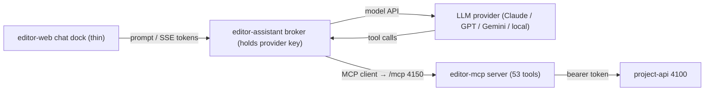

# Editor AI Assistant — in-app chat over the MCP server (plan)

Status: **Implemented (AA-0 → AA-4), 2026-08-01.** The broker service
`Editor/services/editor-assistant` (port 4160) and the editor-web chat dock exist, are
typechecked and tested (6 broker tests incl. a live stub-model E2E; editor-web green), and pass
`check:boundaries`. Two deviations from the original sketch, both deliberate: the broker
**spawns and owns its editor-mcp child over stdio** (the recommended desktop-assistant
transport) rather than attaching to the HTTP server on 4150; and confirm-to-apply is the
default (mutating tools present but always staged), with `--read-only` as the stricter opt-in.
Authority: subordinate to [`architecture.md`](architecture.md). It adds an Editor UI feature;
it changes no product boundary and grows no Program/output verb.

## 1. The one correction that shapes the whole design

`Editor/services/editor-mcp` is an MCP **server**. In the Model Context Protocol an
AI model does not connect *to* nothing — a **client** (the model's host) connects to
the server and calls its tools. Today those clients are external: Claude Code, Codex,
Gemini, Cursor, etc., configured in `.mcp.json`.

To chat with a model **inside** the Editor, the missing piece is not another server.
It is the other half of the protocol: an **MCP client + LLM connector** — an *agent
runtime* — that

1. holds a connection to a model provider (the thing that is "connected"),
2. connects as an MCP client to `editor-mcp`,
3. runs the tool-call loop (model asks for a tool → runtime calls `editor-mcp` →
   result returns to the model), and
4. streams the conversation to a compact chat panel in `editor-web`.



The model reaches the scene only through `editor-mcp` → `project-api`, so it works
under the **same** origin allow-list, bearer token, read-only show mode, audit log,
per-scene write lock, backups and revision counter a human author does (session rule
90). It **cannot** put graphics on air: `assertEditorAuthority` (rule 89) means no
tool here names Cue/Take/Continue/Clear/Program/output, and the engine would refuse
such a call by role anyway.

## 2. Where the agent runtime lives — decision

Model provider credentials must not sit in the browser. `architecture.md` §7 requires
credentials injected into web clients **in memory**, never in browser local storage,
and rule 90 keeps secrets in a service, not the web app.

| Option | Home | Verdict |
| --- | --- | --- |
| **A — new loopback service** `Editor/services/editor-assistant` | Own process on **4160**, holds provider keys, brokers model↔MCP, streams to the UI over SSE. | **Recommended.** Mirrors the existing `project-api` (4100) / `editor-mcp` (4150) topology; works for both desktop shells and `npm run dev:web` browser debugging; one place for keys and the audit of what a model did. |
| B — inside the desktop shell (Tauri/Electron main) | Secrets via native filesystem perms; shell already supervises services. | Alternative. Cleanest for secrets, but leaves `dev:web` (no shell) without an assistant and couples the feature to two shell codebases. |
| C — in the browser directly | — | **Rejected.** Puts a provider key in the browser; violates the in-memory-credentials invariant. |

**Recommendation: Option A.** The desktop shell *ensures* the assistant service the
same way it ensures `project-api`, and injects the per-installation token in memory.
The browser panel never sees a provider key — only a short-lived loopback token for
the broker.

### New port

| Port | Service |
| --- | --- |
| **4160** | `Editor/services/editor-assistant` (loopback; SSE to the UI, MCP client to 4150) |

(4100 project-api, 4150 editor-mcp, 4300 playout-control, 4400–4403 engine, 5173/5174 web — unchanged.)

## 3. How the broker connects to the MCP server

Attach as an MCP client to the **already-running** `editor-mcp` over Streamable HTTP
at `http://127.0.0.1:4150/mcp` (the shell/`dev:mcp` starts it), rather than spawning a
second stdio copy. One server, shared by the in-app assistant and any external client.

- **Safety default: read-only.** Point the broker's MCP client at a server started
  with `--read-only`, or gate every mutating tool behind an explicit **"Apply"**
  confirmation in the chat UI (show the exact tool + arguments; nothing mutates the
  scene until the operator clicks Apply). A live authoring station defaults to
  read-only; a design workstation may opt into confirm-to-apply.
- **Grounding:** the broker seeds each session with the `grapix_orient` prompt and the
  `grapix://primer` / `grapix://capabilities` resources, so the model gets the
  declared-vs-implemented capability map and the authority boundary before it acts —
  the whole reason the knowledge half of the MCP server exists.
- **Concurrency:** mutating tools already send `expected_revision` and re-read before
  writing (README "Concurrency"); surface a "scene changed under the assistant" notice
  rather than silently clobbering.

## 4. Provider abstraction (which model is connected)

A small `ModelProvider` seam in the broker, one adapter per API, all mapping to a
common tool-calling loop:

```ts
interface ModelProvider {
  id: string;                    // "anthropic" | "openai" | "google" | "openai-compatible" | "local"
  label: string;                 // "Claude", "GPT", "Gemini", "Ollama", …
  models(): Promise<ModelInfo[]>;
  chat(req: ChatRequest): AsyncIterable<ChatEvent>;   // streams text + tool-call requests
  supportsTools: boolean;        // tool-calling is required for authoring; chat-only models are advisory
}
interface ConnectionStatus {
  provider: string; model: string;
  state: "connected" | "connecting" | "no-key" | "error" | "rate-limited";
  detail?: string;               // last error, latency, token usage
  toolsEnabled: boolean;         // false in read-only mode
}
```

- Config lives in the broker (env/file, native perms): provider, base URL, model id,
  API key, and a per-provider allow/deny. `openai-compatible` covers local runtimes
  (Ollama / LM Studio / vLLM) so a station can run fully offline.
- **A model without tool-calling** connects as an advisor (it can read `search_knowledge`
  results the broker fetches, but cannot author). The status chip says so.

## 5. The UI — compact by construction ("shall not take too much space")

A dock panel in `editor-web`, in the existing dock-stack system, collapsed by default.

- **Always-visible status chip** (one line, even when the panel is collapsed):
  `● Claude · claude-sonnet · ready` — a colour dot (green connected / amber
  connecting|rate-limited / grey no-key / red error), the provider, the active model,
  and a read-only/apply badge. Clicking the model name opens the tiny model picker.
- **Expanded:** a right-edge or bottom dock (operator-resizable, remembers size) with
  the message list, an input box, and — inline — the tool calls the model made,
  rendered as compact collapsible rows (`create_material { … }` → result), each with an
  **Apply / Skip** control when not in read-only mode.
- **Zero chrome when idle:** collapsed, it is just the status chip in the toolbar
  (~1 line), so it costs no canvas space until opened.

```text
┌ toolbar ───────────────────────────────────────────────┐
│  … tools …            [● Claude · sonnet · ready ▾] [▸] │   collapsed = one chip
└──────────────────────────────────────────────────────────┘
                          ▲ click ▸ opens the dock:
                          ┌─ Assistant ───────────── [–] ─┐
                          │ you: build a blue lower third │
                          │ ▸ add_object {rect …}  [Apply]│
                          │ ▸ create_material {pbr…}[Apply]│
                          │ assistant: added a lower third│
                          │ [ type a message …        ↵ ] │
                          └───────────────────────────────┘
```

## 6. Transport to the UI

The browser panel ↔ broker uses **SSE** for streamed tokens/tool-events (the same
pattern `project-api` and `playout-control` already use for `/events`), plus a small
`POST /assistant/message` to send a prompt and `POST /assistant/apply` to confirm a
staged tool call. `GET /assistant/status` and an SSE `status` channel drive the chip.

## 7. Security and honesty (non-negotiable)

- Provider keys never leave the broker; the browser holds only a loopback session token.
- Every model-initiated mutation is written through `project-api`, so it lands in the
  operator audit log with an `actor: "assistant:<model>"` tag — a model's edits are
  attributable, not anonymous.
- The assistant obeys read-only show mode: when `project-api` is in read-only mode the
  broker forces tools off and the chip shows "advisory".
- No streaming of secrets or tokens into the transcript; redact like the existing logs.
- Rate limiting and a hard monthly/again per-session token budget in the broker, so a
  runaway loop cannot spend without bound.

## 8. Phased plan

- **AA-0 — Broker skeleton. [Implemented]** `Editor/services/editor-assistant` on 4160 spawns
  and owns an editor-mcp child (`mcpClient.ts`), resolves a provider (`config.ts`), and serves
  `GET /assistant/status` + an SSE `status` stream (`index.ts`, `sse.ts`). The editor-web chip
  (`AssistantChip.tsx`) shows the live connection state.
- **AA-1 — Read-only chat. [Implemented]** The bounded tool-call loop (`agent.ts`) streams over
  SSE (`/assistant/message` + `/assistant/stream`); the system prompt is seeded from
  `get_primer` (`index.ts` `buildSystemPrompt`); read tools auto-execute. `--read-only` launches
  the child with only read tools present.
- **AA-2 — Confirm-to-apply authoring. [Implemented]** Mutating tools are staged and applied via
  `/assistant/apply` / `/assistant/skip`; the model may pass `expected_revision` (the MCP tools
  enforce it, rule 91); applied mutations are audited with an `assistant:<model>` actor
  (`audit.ts`). The dock renders each call as a row with Apply/Skip (`AssistantPanel.tsx`).
- **AA-3 — Provider abstraction + model picker. [Implemented]** Anthropic, OpenAI, Google and an
  `openai-compatible` local adapter (`providers/`), a `/assistant/model` switch route, and the
  in-dock picker. Offline local mode works via `GRAPIX_LOCAL_BASE_URL`.
- **AA-4 — Polish. [Implemented]** Last-usage tokens on the status stream, a per-session token
  budget guard (`agent.ts`), transcript persistence under `data/assistant/` (`transcripts.ts`),
  a Ctrl+Alt+A keyboard toggle, and remembered dock height (`assistantStore.ts`).

Each phase typechecks, has tests (broker unit tests + a real MCP-client integration test
against a spawned `editor-mcp`, mirroring `protocol.test.mjs`), and is verified live.

**Desktop supervision — done (2026-08-01).** Both Editor shells start the broker as an **owned**
service (started with the window, stopped on close — it holds no Program authority, unlike the
ensured engine): the Tauri supervisor (`supervisor.rs`) spawns `node …/editor-assistant/dist/index.js`
and health-checks `:4160`, and the Electron main spawns it with `ELECTRON_RUN_AS_NODE`. If a
broker is already running on 4160 it is adopted, not duplicated. `npm run dev:assistant` remains
for running it standalone.

## 9. Open decisions (need sign-off)

1. **Broker as a service (A) vs in the desktop shell (B).** Recommended A.
2. **Default posture on a live station:** read-only always, or confirm-to-apply? (Recommended: read-only on a station flagged live; confirm-to-apply otherwise.)
3. **Provider set for v1** and whether a local/offline model is in scope at AA-1 or AA-3.
4. **Transcript retention:** ephemeral per session, or persisted per project under `data/`.
5. **Does the assistant get its own bearer identity** at `project-api` (distinct from the human) so its audit rows and rate limits are separate? (Recommended yes.)

## 10. What this plan deliberately does not do

- It does not add a Playout assistant or any path to Cue/Take/Program — rule 89 stands,
  and a future Playout MCP server (which *will* own those verbs) is a separate design.
- It does not let a model reach `data/` or the engine directly — every action goes
  through `project-api`, and the engine refuses Editor-role output verbs regardless.
- It does not embed a model in the renderer or on the render thread; inference is a
  broker concern, never in the frame path.
