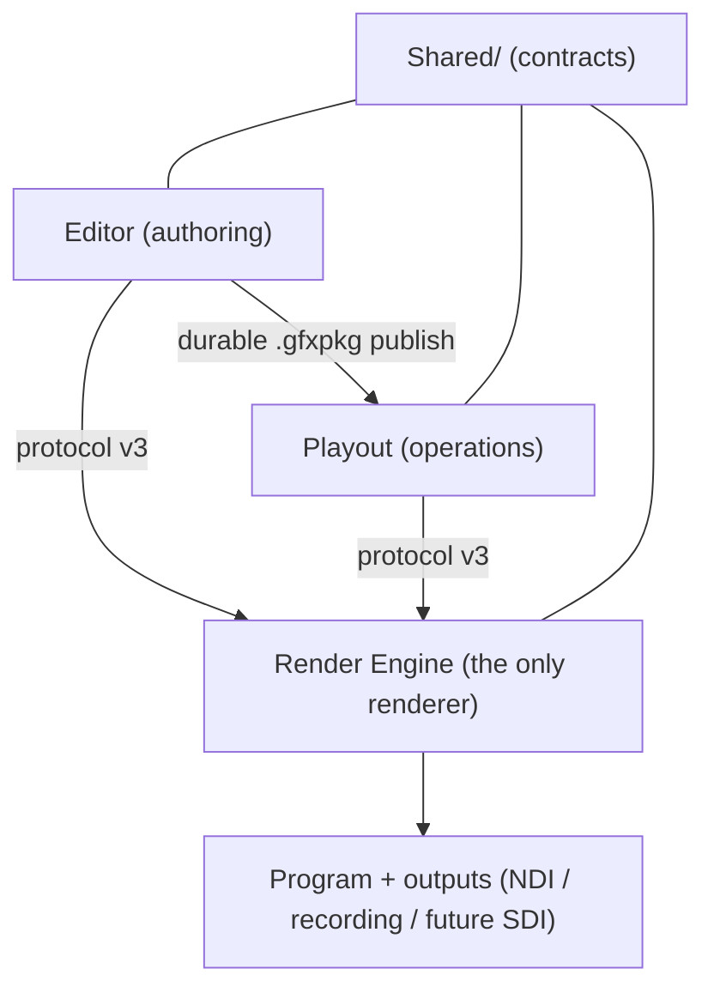
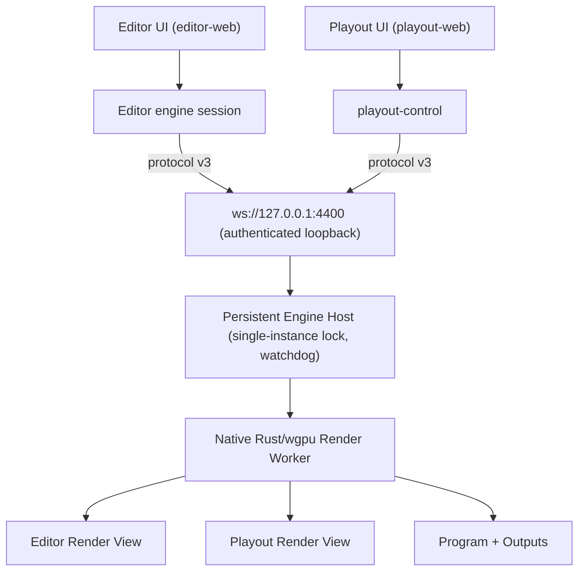

# GrapiX Main Architecture (consolidated)

Status: **Consolidated snapshot — merges every architecture planning document with the as-built codebase**
Synthesized: **2026-08-01**
Baseline evidence: repository state and the automated suites measured **2026-07-29**, plus the live capability map from the Editor contracts.

## What this document is

This is the single merged architecture reference for GrapiX. It reconciles the
planning documents that designed the structure against the code that now exists on
disk, and folds **done / partial / planned** into one status-annotated view.

It **consolidates**, and does not replace, the authority chain. When this document
and a higher-authority document disagree, the higher one wins:

1. [`architecture.md`](architecture.md) — canonical products, invariants, engine host, protocol v3, recovery, V1 gates.
2. [`local-v1-system-design.md`](local-v1-system-design.md) — the design review and the M1–M4 plan.
3. [`editor-playout-workspace.md`](editor-playout-workspace.md) — repository ownership and the migration phase log.

Then the subject detail docs: [`render-engine-architecture.md`](render-engine-architecture.md),
[`render-daemon-architecture.md`](render-daemon-architecture.md),
[`scene-document-v1.md`](scene-document-v1.md), [`material-system.md`](material-system.md),
[`3d-engine-architecture.md`](3d-engine-architecture.md),
[`fonts-sequencing-automation-sdk.md`](fonts-sequencing-automation-sdk.md),
[`design-file-import.md`](design-file-import.md), [`rendering-engine.md`](rendering-engine.md),
[`pixel-parity.md`](pixel-parity.md), [`hardware-certification-template.md`](hardware-certification-template.md),
and the historical ledger [`architecture-review-compliance.md`](architecture-review-compliance.md).

Status vocabulary is the repository's own: **Implemented**, **Partial**, **Planned**,
**External gate** (buildable locally, but completion needs named hardware/SDK/soak evidence).

---

## 1. Product model

GrapiX is exactly three product-level applications, in the same relationship as
Viz Artist / Trio / Engine or Ross XPression Designer / Sequencer / Engine.

| Product | Owns | Never does |
| --- | --- | --- |
| **Editor** | Authoring: scenes, materials, assets, fonts, animation, data bindings, validation, durable **Publish to Playout**. | Own Program or output authority; rasterize production pixels. |
| **Playout** | Operations: published scene library, take lists, timecode, automation, Preview/Program control, output configuration. | Author or mutate a published scene in place. |
| **Render Engine** | Rendering: the only rasterizer of production pixels. Owns all GPU state, the rational frame clock, Program and outputs. | Depend on React/Electron/DOM; accept Program/output verbs from an Editor role. |

`Shared/` holds the contracts all three consume. It is **not** a fourth product and
may not depend on Editor or Playout — enforced by `npm run check:boundaries`.



## 2. Non-negotiable invariants — [Implemented as constraints; enforcement partial]

1. The Render Engine is the only implementation that evaluates and rasterizes production pixels.
2. Editor and Playout never import renderer internals or own Program GPU state.
3. Editor owns mutable authoring content; it cannot change Program or outputs.
4. Playout is the only client allowed to Cue, Take, Continue, Clear Program or configure outputs.
5. Program, its frame clock and outputs continue if Editor, Playout or both close.
6. A mutable Editor scene can never replace a published Playout scene in place.
7. A fallback may not silently produce visually different pixels.
8. A process/transport can fail; GrapiX guarantees detection, indefinite reconnect, verified recovery and explicit degraded state — never an "unbreakable connection" claim.

**Enforcement gap:** invariant 4 is honoured today because the Editor no longer *issues*
Program/output commands (the daemon bridge and every `/api/render-daemon/*` route were
deleted), but the engine does **not yet refuse** them server-side by role. Engine-side
role authorization is **milestone M2 (Partial/Planned)**.

## 3. As-built repository architecture

Verified against `package.json` workspaces and on-disk directories. Divergences from the
original planning sketch are deliberate decisions, recorded here.

```text
GrapiX/
├── Editor/                              @grapix/editor-workspace
│   ├── apps/
│   │   ├── editor-web/                  @grapix/editor-web        React + Pixi(2D) + three.js(3D) + SVG overlay viewport
│   │   ├── desktop-tauri/               @grapix/desktop-tauri     primary shell: runs project-api, ENSURES engine
│   │   └── desktop-electron/            @grapix/desktop-electron  fallback shell
│   └── services/
│       ├── project-api/                 @grapix/api-server        project/asset/package/publish service (port 4100)
│       └── editor-mcp/                   @grapix/editor-mcp        MCP authoring surface (port 4150 over HTTP; else stdio)
├── Playout/                             @grapix/playout-workspace
│   ├── apps/
│   │   ├── playout-web/                 @grapix/playout-web       operator UI
│   │   └── desktop-tauri/               @grapix/playout-desktop   shell: supervises engine + control, adopts if already up
│   ├── services/playout-control/        @grapix/playout-control   library, take lists, operator commands, monitors (port 4300)
│   └── tools/dev.mjs                                              one supervisor for web + control + engine
├── Shared/                              @grapix/shared-workspace  13 contract packages (see §4)
├── services/
│   ├── render-engine/                   crate grapix-render-engine (bin) — protocol v3, tiles, virtual canvas, outputs (4400–4403)
│   └── render-daemon/                   crate grapix-render-core (lib) — scene parse, mesh prep, text shaping, wgpu; v2 binary DELETED
├── tools/
│   ├── architecture/                    check-workspace-boundaries.mjs, clean-dist.mjs
│   └── certification/                   engine/playout/publish/ipc/parity/monitor/animation harnesses
├── docs/                                this document and its authority chain
└── data/                                runtime state only (scenes, assets, packages, take-lists, backups, caches) — gitignored
```

Both Rust crates pin **wgpu 26**. `grapix-render-engine` depends on `grapix-render-core`
by path (`../render-daemon`) — ~10.5k lines of tested core reused rather than rewritten.
The engine adds the virtual canvas, tiles, render graph, protocol v3, config, capabilities,
preview and diagnostics.

**Deliberate divergences from the original sketch** (all recorded in `editor-playout-workspace.md`):
- `Shared/` kept its existing package names instead of the sketch's schema-oriented renames.
- `tools/migration/` was never created (no migration script outlived its move).
- Output adapters stayed in the engine (`services/render-engine/src/outputs.rs`), because the
  engine owns Program; `Playout/output/{ndi,decklink,aja}` deliberately does not exist.
- `render-daemon` stayed under `services/` (not moved under Playout) because it is now the
  engine's core library; moving it would break "keep the engine deployable independently".
- `common-utils` was never created (an empty utility package attracts everything that does not fit).

## 4. Shared contracts — [Implemented]

Thirteen application-neutral packages consumed by Editor, Playout and the Engine. None
depends on an application (guarded).

| Package | Role |
| --- | --- |
| `@grapix/shared-types` | `SceneDocument` v1, objects, materials, animation, fonts, `RundownDocument`, transitions; the durable schema + fixtures. |
| `@grapix/scene-model` | Scene separation, revisions, incremental patches. |
| `@grapix/stage-model` | Virtual canvas, regions, viewports, cameras; the f64→f32 rebase rule (`toTileLocal`/`toViewportLocal`). |
| `@grapix/surface-model` | Physical display surfaces (LED wall, projector, ribbon…) and output mapping. |
| `@grapix/tile-system` | Tile grid, culling, dirty tracking, overscan, seam-free composition. |
| `@grapix/animation-engine` | Rational broadcast frame clock and frame evaluation. |
| `@grapix/asset-manager` | Asset state machine, content addressing, upload. |
| `@grapix/renderer-contracts` | `RendererBackend`, `RenderGraph`, `SceneRuntime` contracts. |
| `@grapix/output-contracts` | Output adapter descriptors and formats. |
| `@grapix/shader-library` | Metadata/validation over the shared WGSL. |
| `@grapix/render-shaders` | WGSL sources + `layouts.json` byte contract, blend ids, colour/alpha rules (the drift guard). |
| `@grapix/render-protocol` | Protocol **v3** client + `EngineConnection`; the only engine client contract. |
| `@grapix/sdk` (`grapix-sdk`) | Scene automation authoring contracts (`defineSceneScript`, `GrapixSequenceEngine`). |

The retired **protocol v2 TypeScript client** (`Shared/renderer-protocol`) was deleted; a
dependency on any retired package fails `check:boundaries`.

## 5. Local V1 runtime and protocol



- **Transport:** authenticated loopback WebSocket; a per-installation token is read by native
  services and injected into web clients in memory (never browser local storage). IPC is
  supported infrastructure, not the V1 application path.
- **Connections are application-scoped**, not panel-scoped: heartbeat, sequence tracking,
  dedupe, resync and indefinite reconnect run for the application lifetime. (Moving the
  Editor connection out of `RenderEnginePanel` to application scope is **M1**, partly landed.)
- **Engine Host ownership:** either app may *ensure* the host is running; neither owns or
  stops it on window close. Program outlives an authoring window.
- **Precedence for engine config:** CLI arg > env var > TOML > built-in default (resolves
  without a GPU via `--print-config`).

### Ports

| Port | Owner |
| --- | --- |
| 4100 | `Editor/services/project-api` (`@grapix/api-server`) |
| 4150 | `Editor/services/editor-mcp` (HTTP mode; else stdio) |
| 4300 | `Playout/services/playout-control` |
| 4400–4403 | `services/render-engine` and additional render nodes |
| 5173 / 5174 | editor-web / playout-web (Vite) |
| 4200 | **retired** — the protocol-v2 daemon, deleted 2026-07-29; nothing may bind it |

### Render View extensions

A Render View is a specialised view of the one native renderer, not a second renderer in React.

- **Editor Render View** — mutable authoring scenes, private per Editor session, colour/alpha
  + picking/bounds/camera metadata, adaptive resolution, latest-frame-wins. No Program authority.
  **The native Editor Render View is milestone M2 (Planned); today the Editor authors through a
  browser Pixi/Three viewport — the largest open item.**
- **Playout Render View** — operational Preview + Program confidence monitors, immutable published
  revisions. **Implemented for the confidence monitors:** `playout-control` republishes the engine
  `preview.streamStart` stream as refcounted `multipart/x-mixed-replace` MJPEG at
  `GET /api/playout/monitor/{preview,program}?view={fill,key}`. Fill and key are render modes
  (greyscale key, JPEG-exact), not an alpha channel.
- **Program extension** — global, Playout-role only; owns the rational frame clock and output
  adapters; first priority for GPU memory/scheduling/residency.

Render priority order: **Program > Playout Preview/prepared > Editor active view > background thumbnails/exports.**

### Scene and channel isolation — [Partial]

Every loaded scene is addressed by `SceneRef { projectId, domain: "authoring" | "published", sceneId, revision }`.
Authoring scenes are mutable/private; published scenes are immutable checksum-verified revisions;
Program accepts only `domain: "published"`. **Today engine scenes/Preview are keyed globally**, so
Editor and Playout can still collide on scene ID or Preview selection — domain keying is **M2 (Planned)**.

## 6. Capability status — the merged done / to-be-done view

Status folds the compliance ledger, the material/3D/fonts detail docs, and the **live capability
map** (which supersedes the older ledger where they differ).

### 6.1 Implemented

- **Workspace split & guardrails:** three-product monorepo; `check:boundaries` fails on cross-domain
  manifest deps, cross-domain relative imports and retired-package deps.
- **Standalone engine:** Rust/wgpu `grapix-render-engine`, protocol v3 (heartbeat, sequence, dedupe,
  reconnect, acknowledgement, message/engine/project ids), headless-capable.
- **Protocol v2 fully retired:** binary, transport, controller, config and the TS client deleted
  (~3,250 lines); port 4200 unbindable.
- **Desktop shells:** Editor Tauri (primary) + Electron (fallback) *ensure* the engine and never stop
  it; Playout Tauri (`@grapix/playout-desktop`) supervises engine (4400) + control (4300), **adopts**
  either if already running, and on close stops only what it started. Asserted by a unit test in each shell.
- **Editor project service** (`@grapix/api-server`): atomic temp+fsync+rename writes, monotonic
  revisions, backups with explicit recovery, SHA-256 asset dedupe, operator/action logging.
- **Editor MCP server** (`@grapix/editor-mcp`): authoring-only tool surface (a build-time guard fails
  if a tool ever names Cue/Take/Continue/Clear/Program or an output verb).
- **Playout operator model (XPression Sequencer):** **Scene Manager** keyed by numeric **Take ID**
  (assigned on first publish from 101, stable across republishes, freed ids reused) + optional ordered
  **Take List** with a persisted cursor that clears (never wraps) and autosaves (no revision counter).
  Ambiguous command (Take ID *and* entry) is refused. Direct recall tracked as `scene:take-<id>`.
  **Take Out** (clear Program) and **Continue** (advance cursor) implemented.
- **Confidence monitors:** refcounted fill/key MJPEG streams (`certify:monitors`).
- **Animation playhead:** Program clock advances the on-air scene's playhead, reported per scene as
  `frame`; take rewinds to 0, cue does not rewind an already-on-air scene (`certify:take-animation`).
- **Publish/packaging:** strict versioned `.gfxpkg` v2 — manifest, scene, materials, assets, bindings,
  optional `fonts.json`/`automation.json`, declared renderer/features/fonts/shaders/codecs/memory,
  SHA-256 per file, ZIP re-open/verify, tamper rejection.
- **Animation engine (AN-1):** typed per-property `Animatable<T>` channels (`PropertyChannelMap`) and
  `evaluateSceneAtFrame`; all declared animatable properties (opacity, x, y, zDepth, rotation X/Y/Z,
  scale X/Y/Z) are evaluated — the scalar-snapshot gap is closed.
- **Shapes / pen tool / paths (editor 2D):** `ShapeSceneObject`, Lottie-shaped cubic bézier paths,
  fill/stroke, masks (all `MaskMode`s implemented), editor pen interaction, and matched-vertex path
  interpolation in the shared evaluator. (Advanced operators, trim paths and native daemon tessellation
  remain — see §6.2.)
- **Native text:** cosmic-text Unicode bidi/OpenType shaping and fallback from packaged font bytes
  (`nativeTextRender=true`, `packagedFontFiles=true`); the API resolves remote CSS to project assets
  before warm/Take (`remoteFontCss=false`).
- **Font Manager:** packaged OTF/TTF/WOFF/WOFF2, HTTPS stylesheet/`@import`, Google Fonts and
  normalized Adobe Fonts links; private-network/redirect blocking; checksum-deduplicated assets.
- **Materials — one Standard Material** (`pbr` canonical + solid-color/image/unlit-texture/basic-lit
  wire aliases): six blend modes (normal/add/multiply/screen/darken/lighten, mirrored to PixiJS
  premultiplied equations), UV offset/scale/rotation with clamp/repeat/mirror wrap and
  linear/nearest filtering, fit modes stretch/fill/crop, one-level material instances, shared updates,
  opacity/tint, protected deletion, missing/relink, usage lookup, shared WGSL + manifests.
- **3D (real geometry) in both renderers:** depth-tested tessellated cube/slab/sphere/cylinder/torus
  + embedded glTF/GLB triangle geometry, authored PBR base materials + per-face/per-element overrides,
  textures/UV controls, directional/point/spot authored lights (mesh lighting selected by material
  type; solid/unlit ignore lights; Basic Lit/PBR consume them; readable fallback with no light;
  deterministic **16-light Take gate**). Editor uses three.js behind a swappable `SceneRenderer`;
  active perspective/ortho camera drives the editor mesh projection.
- **Design import:** PSD (`ag-psd`), SVG-compatible AI, SVG, exported/API Figma → normalized document
  → scenes/assets + structured compatibility report; fixture-tested.
- **Virtual canvas / tiles:** f64 stage up to 50,000², f64→f32 tile-origin rebase rule, per-tile
  overscan, index-driven tile selection, seam-free composite.
- **Pixel parity (native):** determinism, tile-composite vs single-pass byte-identity, far-vs-near
  edge (f32 precision), Program capture determinism — **zero differing pixels on RTX 3070 Ti (Vulkan)**.
- **Scene scripts:** per-scene checksummed script refs + `@grapix/sdk`; static import gate; **not
  executed** in API, webview or renderer (declarative rules are the production execution path).
- **Resource profiles:** EDITOR_PREVIEW / PROGRAM_HD / PROGRAM_UHD / SAFE_MODE govern
  output/cache/texture/decoder/3D/render-target/shadow/effect/background budgets; active channels protected.

### 6.2 Partial — in progress / to be done

| Area | Done | Remaining |
| --- | --- | --- |
| **Editor Render View (M2)** | Browser viewport behind one `SceneRenderer` interface; Editor holds no Program authority. | Replace Pixi/Three browser rasterizer with the native Editor Render View + binary alpha frames. **Largest open item.** Until then authored pixels are a documented parity risk. |
| **Engine role authorization (M2)** | Editor no longer issues Program/output verbs. | Engine must *refuse* Program/output commands by authenticated role server-side (invariant 4). |
| **Scene domain keying (M2)** | `SceneRef` contract defined. | Key engine scenes by project/domain/scene/revision so authoring/published cannot collide; split private Editor views from Playout Preview/Program. |
| **Durable Program recovery (M3)** | Contracts (`ProgramRecoverySnapshot`, `OutputLease`) defined; unsafe recovery removed from the Editor shell. | Engine-side journal of every accepted Program/output/data mutation, atomic snapshot, first-frame-off-air restore, crash/device-loss/corrupt-state tests. |
| **Video** | Decoder lifecycle + budget + bounded latest-frame queue modeled; API probe reports certification needs. | Native codec/hardware decode is deliberately unavailable and **blocks publish/Take** until certified. |
| **3D depth of field** | Real meshes/lights/glTF geometry + PBR in both renderers. | Native active-camera consumption, hierarchy/timeline-resolved light transforms, skeletal/morph animation runtime in native, shadows, LOD, native transparent depth ordering, hardware parity. |
| **Materials depth** | Standard Material, blend, UV, fit, lighting. | Native 2D sprite/text material path, per-material browser samplers (WebGPU bind group), custom shader execution (compiler worker), video materials, chroma/mask/gradient pipelines, tile/nine-slice fit, material export/copy-paste, GPU-memory estimates, cross-scene texture residency + deferred disposal. |
| **Shapes / paths depth** | Shape object, bézier paths, fill/stroke, masks, pen tool, path interpolation (editor 2D). | Advanced shape operators (repeater/merge/boolean/round-corners), animated Trim Paths, and complete native daemon path tessellation for Program parity. |
| **Transitions** | T0 **cut** executes; mix/dip/wipe/push/custom persist and sequence correctly. | T1 (dual render targets, progress/cancel/complete events, HD/UHD headroom + dropped-frame certification) and T2 (validated bounded WGSL manifest) — non-cut kinds return **`deferred`**, never a silent cut. |
| **Publish plane (Phase 5)** | `.gfxpkg` build + local staging/promotion path. | Endpoint management/auth/discovery, upload with progress/cancel, reconnect/idempotency/duplicate tests, offline reconciliation. |
| **Operator depth (Phase 6/7)** | Cue→Preview, cut→Program, autosave. | Take-list editing depth, output configuration, layer/channel conflict model, timecode/instance-data live updates, control-API breadth. |
| **Live data patch** | `scene.patch` typed, revision/sequence-safe, rate-limited, frame-boundary coalesced; conditional triggers emit the same typed actions. | Update only affected prepared binding targets instead of re-preparing the whole scene (optimization gate). |
| **Asset workers** | SHA-256 dedupe, alias/priority/tier accounting, referenced-asset protection. | Thumbnail/proxy workers, promotion accounting, folder mutation. |
| **Script sandbox** | Static import restriction + declarative rules. | Isolated disposable worker (no fs/net, CPU/wall/memory limits, signed approval) before any on-air script execution. |
| **RAM/VRAM enforcement** | Telemetry: last/avg/p99 render time, budget utilization. | Live RAM/VRAM enforcement and long-run evidence. |
| **Soak gate** | — | **No harness.** The 8/24-hour soak drove the retired v2 path and was deleted; a replacement must drive the engine over v3 with Playout as the only controller. Gate is openly unmet. |

### 6.3 Planned / External gate

- **M4 — optional local Playout standby (Planned, disabled by default):** a separate certified
  worker promotable to Program only with exact journal offset, matching package/asset checksums,
  first-frame validation, and a monotonic output lease/fence. Covers a render-process crash, **not**
  shared GPU/driver/OS/machine failure. Editor Render View is never Program-eligible.
- **Hardware certification (External gate):** HD Basic/Advanced/UHD/3D/Multi-Channel tiers need
  representative machines + output hardware; use [`hardware-certification-template.md`](hardware-certification-template.md).
  No tier is certified by repository tests alone.
- **Vendor output (External gate):** NDI is `--features ndi` (needs NDI SDK 6.x); DeckLink/AJA not present.
- **V2 boundary (Planned, out of V1 scope):** remote Editor↔Playout publishing, remote render nodes,
  TLS/mTLS, discovery, primary/backup machines, cross-machine output fencing, distributed tile rendering,
  venue-network security. V1 keeps stable engine/project/scene/state-revision/output-lease identifiers so
  V2 needs no scene or protocol rewrite.
- **Future integrations (last priority):** browser WebGPU renderer on the shared WGSL; GrapiX consuming
  Figma Dev Mode MCP and Adobe Firefly Services MCP for import/generation (imported assets flow through
  the normal asset + material + render pipeline, never a side channel to the renderer).

## 7. Milestone and phase status

### Design milestones (`local-v1-system-design.md`)

| Milestone | Scope | State |
| --- | --- | --- |
| **M1** | Canonical contracts; client identity/scene-domain/view/state-revision; persistent Engine Host; move Editor connection to application scope. | **Partial** — docs authoritative; shells ensure the engine; connection-scope move in progress. |
| **M2** | Engine-side role permissions; project/domain/scene/revision keying; split Editor views from Preview/Program; **native Editor Render View + binary alpha frames**. | **Planned** — the largest remaining block; gates pixel parity. |
| **M3** | Remove v2 sidecars/fallback (done); Program journal + atomic snapshot + first-frame restore; crash/device-loss/corrupt-state tests. | **Partial** — v2 removed; durable recovery not yet built. |
| **M4** | Optional certified standby: separate worker, journal replication, output-lease fencing, GPU/VRAM + soak/output certification. | **Planned** — disabled until certified. |

### Workspace phase log (`editor-playout-workspace.md`)

| Phase | State |
| --- | --- |
| 0 — Stabilize branch (Basic v0.1) | **Complete** |
| 1 — Master workspace scaffold + boundary guard | **Complete** |
| 2 — Mechanical Editor preservation move (`git mv`) | **Complete** |
| 3 — Extract 13 Shared packages from `packages/` | **Complete** |
| 4 — Playout foundation (shell, control service, published versions, take-list autosave, cue→preview, cut→program) | **In progress** — remaining: upload/promotion, edit depth, output config, offline reconciliation, later transitions/automation |
| 4a — Retire protocol v2 from both apps | **Complete** |
| 4b — Replace rundown with XPression operator model | **Complete** |
| 5 — Publish to Playout (endpoints/upload/promotion) | **To do** |
| 6 — Operator Preview/Program (conflict model, statuses) | **To do** |
| 7 — Sequencing & automation (cursor, Take ID recall, timecode, T1 transitions, control API) | **To do** |
| 8 — Reliability & certification (crash/restart/offline, 80-scene, soak, device/output loss, NDI→DeckLink/AJA) | **To do** |

**Historical closure (from the design review's nine findings):** #3 (Editor packaged the v2 daemon),
#4 (Playout v2 fallback), #5 (a shell could stop the engine it started), #9 (docs mixed V1/V2 + stale
paths) are **Closed**. Findings **#1 (browser production canvas), #2 (panel-scoped connection),
#6 (role enforcement), #7 (global scene keying), #8 (no durable restore)** remain the open blockers,
covered by M1–M3 above.

## 8. Scene contract, materials and shaders (load-bearing rules)

- **`SceneDocument.version` is frozen at `1`.** Additive optional fields only; any required/renamed/
  removed field, changed unit, coordinate system or semantic meaning needs a new version + explicit
  migration. Unknown versions are rejected, never coerced. Runtime state (Preview/Program selection,
  warm cache, GPU/decoder handles, frame counters, viewport nav) never lives in the document.
  Normalization boundary: `normalizeMaterialSceneDocument` / `normalizeScene`.
- **One shader layer, two hosts.** `Shared/render-shaders` owns the WGSL, `layouts.json` byte layouts,
  blend ids/equations, sRGB→linear + premultiplied alpha rules and transform composition formulas.
  Enforced by test (`layout_contract.rs` asserts `#[repr(C)]` structs match `layouts.json` byte-for-byte);
  the browser WebGPU host, when it lands, must run the equivalent assertion against the same file.
- **TS↔Rust scene contract by fixtures:** `shared-types` emits `fixtures/scene-document.v1.json`; the
  render core parses it in `scene_contract.rs`. A `SceneDocument` change breaks the fixture compile or the
  Rust test — never a silent runtime misread.
- **Frame clock:** integer math on rational rates (e.g. 59.94 = `60000/1001`, never a float), 1–240 fps;
  the wait is interruptible so stop/shutdown never blocks a frame interval.

## 9. Known traps — declared but not rendered

Several enums accept values the renderers ignore: authoring one produces a scene that **saves and
validates cleanly, then renders as something else**. Do not author these until implemented.

| Enum | Implemented | Declared but NOT rendered |
| --- | --- | --- |
| `MaterialBlendMode` | normal, add, multiply, screen, darken, lighten | **overlay, subtract, alpha-mask, inverse-alpha-mask** (need a shader compositing pass; a stray one is refused + warned, never aliased to Normal) |
| `TextureFitMode` | stretch, fill, crop | **fit, tile, original, pixel-perfect, nine-slice** (render as `stretch`) |
| `TransitionKind` | cut | **mix, dip, wipe, push, custom** (persist/sequence but execute as `deferred`) |
| `MaterialType` | pbr (+ solid-color/image/unlit-texture/basic-lit aliases) | video, gradient, text-style, svg-vector, shader, image-sequence, chroma-key, matte, additive-glow (normalize on load; native rendering not present) |
| Video decode | lifecycle/budget modeled | native codec/hardware decode absent → blocks publish/Take |

## 10. Failure and recovery model — [Partial: shell behavior done; engine restore Planned (M3)]

| Failure | Required V1 behavior | State |
| --- | --- | --- |
| Editor / Editor Render View closes | Program + Playout Preview continue; reopening resumes a private view. | **Done** (shell ensures, never stops). |
| Playout UI closes | Program/outputs/host continue; reopening reconciles before enabling controls. | **Done** for shell lifecycle; reconciliation depth Partial. |
| Render View session fails | Restart only that view; show cached last-good frame with visible `RECOVERING`. | **Planned** (rides on the native view, M2/M3). |
| Protocol connection fails | Reconnect indefinitely, authenticate, compare state revisions, full-sync gaps, resubscribe. | **Partial** (primitives exist; full resync path with M2/M3). |
| Primary worker crashes | Host restarts it, restores a verified Program snapshot, resumes outputs after a valid first frame. | **Planned (M3)** — journal/snapshot not built. |
| GPU device lost | Recreate device/pipelines, same verified restore. | **Planned (M3)**. |
| Machine/GPU hardware fails | Local V1 cannot maintain Program; multi-machine/second-GPU is V2. | **Out of scope (V2)**. |

Cached last-good frames maintain operator context during recovery and are **never** transmitted as
fresh Program frames.

## 11. Certification and evidence

**Automated suites (measured 2026-07-29, 826 tests total):** Shared contracts 439, `@grapix/api-server`
18, `@grapix/editor-web` 45, Editor desktop (Rust) 5, `@grapix/playout-control` 5, render core (Rust,
incl. GPU smoke) 97, render engine (Rust) 217. Plus a clean `typecheck` and `check:boundaries` across
every workspace.

**Certification harnesses** (none certifies NDI / a decoder / a vendor card / a hardware tier alone):

| Command | Proves |
| --- | --- |
| `certify:render-core` | Deterministic 80-scene lifecycle gate (Rust). |
| `certify:engine` | Real protocol-v3 TS client against the running engine. |
| `certify:ipc` | Local IPC transport with its own engine. |
| `certify:playout-engine` | Publish → prepare → cue → take → clear over Playout HTTP. |
| `certify:publish-takelist` | Editor publish → Scene Manager → Take List → air. |
| `certify:monitors` | Confidence-monitor MJPEG transport. |
| `certify:take-animation` | Program-clock playhead / take-rewind behavior. |
| `certify:parity` | Native pixel parity (see [`pixel-parity.md`](pixel-parity.md)); browser side is `SKIP` until a capture is provided — no browser automation in the repo. |
| `certify:materials` | Shared fixtures + the `--no-default-features` build. |

**Open gate:** the **8/24-hour soak has no harness** (the v2-based one was deleted). Hardware/vendor-output
runs require [`hardware-certification-template.md`](hardware-certification-template.md).

## 12. V1 acceptance gates (from `architecture.md`)

- Editor and Playout auto-connect and recover without manual action.
- Closing either or both apps does not stop Program or outputs. **[Done]**
- Editor, Playout Preview and Program are pixel-parity for the same `SceneRef`/frame/data (materials,
  fonts, lights, cameras, 3D, alpha). **[Native parity Done; Editor-vs-Program blocked on M2 native view]**
- Editor-role Program/output commands are rejected by the engine. **[Planned — M2]**
- Authoring and published scenes with the same scene ID cannot collide. **[Planned — M2]**
- Worker kill causes verified restart and Program restoration. **[Planned — M3]**
- Corrupt recovery state holds outputs safe with an actionable diagnostic. **[Planned — M3]**
- No packaged app launches or connects to protocol v2. **[Done — v2 binary/transport deleted]**
- Nightly 8-hour local soak passes. **[Unmet — no harness]**
- Release hardware completes a 24-hour GPU/output certification run. **[External gate]**

## 13. Next concrete step

Per the phase log and design review, the next implementation step is **milestone M2**:
engine-side role enforcement, project/domain/scene/revision keying, and the **native Editor Render
View** with binary alpha frames — not feature redesign and not another repository-wide move. Any move
is gated on `check:boundaries`, a full `typecheck`, `npm test`, **and probing the running system**:
every fault the Phase 2/3 moves caused was silent and none would have been caught by a typecheck.
