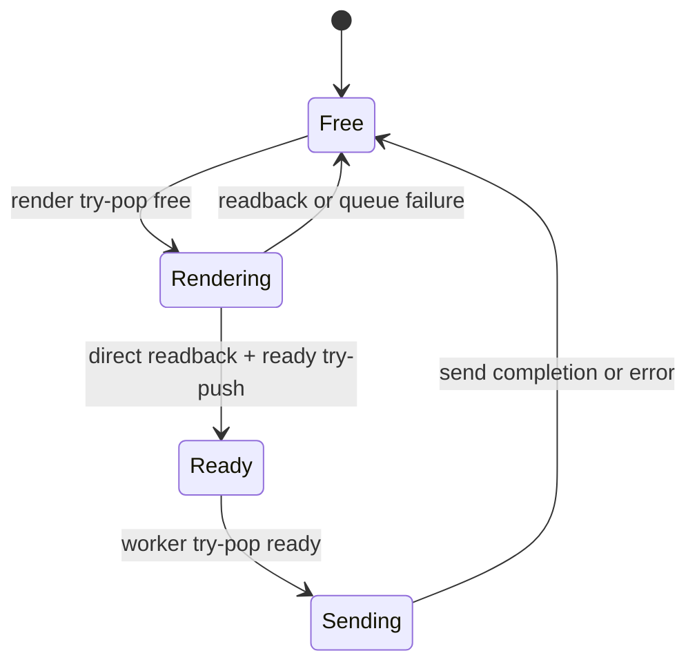

# NDI Output Integration Architecture Plan

**Status:** Council consensus, 2026-08-02  
**Scope:** Native NDI output from the GrapiX Render Engine Program path: `services/render-engine/src/outputs.rs`, the legacy `services/render-daemon/src/output/ndi.rs` path, and `@grapix/output-contracts`.

## 1. Agreed NDI architecture and authority rules

NDI is a **single Engine-owned live output**. The Render Engine alone owns Program pixels and clock, GPU/readback state, video slabs, the NDI sender, and transmission worker. The daemon's existing per-frame SDK frame allocation/copy cannot be a competing sender path: it is retired or absorbed before live NDI is enabled.

| Product | Authority | Must not do |
| --- | --- | --- |
| Editor | May display NDI descriptor/status and author content for publishing. | Configure or control outputs; issue `takeOnline` or `takeOffline`; own Program pixels. |
| Playout | Authenticated output configuration and `takeOnline` / `takeOffline`; presents health/certification warnings. | Own sender threads, GPU resources, or output buffers. |
| Render Engine | Validate config, reserve output resources, render Program, own pool/worker/sender, report state. | Accept output authority from Editor or a client-provided role. |

Lifecycle: an authenticated Playout principal `output.configure`s an offline NDI instance with format and declared options (`sourceName`, optionally groups). The Engine validates and reserves all CPU/GPU resources, then creates fixed resources and worker off the Program path. `takeOnline` starts the configured output. `takeOffline` closes admission, joins/drains worker, destroys sender, and releases all reservations. Existing credential-derived principals, authenticated transport token boundary, enabled-adapter allowlist, and audit/recovery journal remain mandatory. `sourceName` is non-empty, bounded, rejects control characters, and immutable while running. Changing it or format requires offline reconfiguration.

## 2. Bounded VideoFramePool and non-blocking SPSC handoff

### Resources created off tick

Every NDI output owns a fixed-format `VideoFramePool`: initially 3–4 profile-tunable full-size CPU slabs, each exactly `stride * height`, persistent GPU render/readback staging resources, fixed-capacity SPSC `free` and `ready` rings, and a dedicated worker exclusively owning `grafton_ndi::Sender` and every NDI call. Rings carry only a slot index and fixed metadata (frame number, deadline, width, height, stride, format identity). The existing resource governor admits the complete CPU/GPU footprint before configure succeeds. No pool or ring can grow. Sender construction, NDI initialization, worker start/stop, logging, status-string/error construction, and allocation are off tick.

### Ownership and shutdown

Program is the sole consumer of `free` and producer of `ready`; the worker is the sole consumer of `ready` and producer of `free`. Release/acquire publication makes both rings bounded and lock-free. A slot is in exactly one state: its memory is never cloned, reallocated, or concurrently mutated.

Shutdown closes admission and advances a generation/fence, wakes and joins the worker, then drains/reclaims all slots before destroying sender/pool. The pool always outlives the worker; an old worker cannot return an index into a destroyed or newly-configured pool.

The pinned binding source must prove when NDI releases its pointer. A worker returns a slot immediately after `send_video` only if the SDK/binding guarantees synchronous consumption. If it retains bytes, worker code uses its documented asynchronous completion/flush/release rule first. Method naming is not evidence.

### Program tick and worker

For every running NDI output, the 16.683 ms tick: (1) calls `free.try_pop()` once; (2) if empty, increments `framesDroppedPoolExhausted` and performs no NDI readback; (3) readbacks directly into the leased slab using persistent GPU resources; (4) publishes metadata through one `ready.try_push`; (5) on readback failure or a full ready ring, returns the slot and increments the corresponding drop counter.

The tick performs no wait, mutex acquisition, allocation/capacity growth, `Vec` clone, copy into an SDK-owned buffer, NDI/network call, retry/backoff, dynamic error construction, or per-frame logging. Congestion drops NDI only and cannot stall Program or another output. A transparent/no-scene frame, if needed, uses a leased pre-zeroed slab, never an ad-hoc `Vec`.

The worker dequeues ready slots, describes the slab directly to NDI without copying, blocks only in its own vendor call, and returns the slot after the verified lifetime point. v1 uses an in-process worker with a narrow pool/control boundary. A supervised local output host may later replace it for vendor-FFI containment, but is neither required for v1 nor a second sender path.

## 3. Alpha, color-space, and format contract

NDI v1 accepts only:

| Field | Required value |
| --- | --- |
| Layout | `bgra8`, declared byte stride |
| Alpha | Premultiplied |
| Scan | Progressive |
| Primaries | Rec.709 |
| Transfer | Explicit sRGB or Rec.709-compatible transfer selected by Engine contract; never inferred from BGRA |
| Rate/aspect | Declared rational frame rate and pixel aspect (normally 1.0) |

The handoff preserves width, height, stride, rate, frame number, and deadline; it validates `slab.len() >= stride * height` and maps exact pitch/layout to NDI. `straight`, `opaque`, interlaced, Rec.2020 PQ/HLG, and unrecognized spaces are rejected at configure in v1. NDI must never silently premultiply/unpremultiply, discard alpha, reinterpret a color tag, or run a hidden conversion.

The exact `grafton-ndi` frame alpha/pixel metadata and byte lifetime are verified from its pinned source and a real receiver. `PixelFormat::BGRA` alone does not prove premultiplied behavior. `@grapix/output-contracts` therefore advertises only v1 capability: `bgra8`, premultiplied alpha, progressive, and selected Rec.709/sRGB representation. Generic `OutputFrame` bytes remain borrowed and synchronous; the asynchronous implementation uses an Engine-internal leased-slot index contract and never retains generic caller bytes after `send` returns.

## 4. Telemetry, error recovery, and honest certification

States remain `idle`, `configured`, `running`, and `error`. Off-tick status includes monotonic accepted/readback-complete, enqueued, sent, pool-exhaustion, ready-ring, readback, and NDI/network-drop counters; free/ready depth and pool high-water use; worker readiness; safely queried receiver/network health; last successful send; reconnect count; stable error code and `lastError`. Pool exhaustion is normal bounded backpressure, not an Engine failure.

A sender/SDK/network failure is contained in the worker: atomically close new NDI admission, record error, return/drain all slots, set `error`, and emit one output-health event. Program still advances and must neither retry NDI nor fail because network transmission failed. Default recovery is explicit Playout offline then configure/start/online. Automatic recreation is allowed only if documented safe by the binding; it is bounded, rate-limited, worker-only, visible in status, and never holds slabs or runs on Program.

`hardwareCertified` is **false** when code compiles, SDK loads, a sender exists, a receiver connects, or a socket opens. It becomes true only with persisted, reviewable evidence keyed to build, SDK version, NIC/network profile, receiver, selected format, alpha interpretation, and soak result. Evidence includes real-receiver premultiplied BGRA/color validation, sustained delivery, and disconnect/recovery tests. Until review, Playout shows the live-show warning and the descriptor reports false.

## 5. Independent workstreams and implementation plan

| Workstream | Deliverable | Dependency |
| --- | --- | --- |
| A. Contract/control | Exact NDI descriptor/options/status plus credential-derived Playout-only lifecycle, allowlist, audit. | Existing capability matrix |
| B. Pool/readback | Fixed-stride leased pool, resource admission, persistent GPU staging, SPSC index rings/direct readback. | A format vocabulary |
| C. Worker | Engine-owned sender, proven byte lifetime, generation/drain shutdown, error containment; remove duplicate daemon sender. | B slot contract |
| D. Format evidence | Verify pinned binding mapping/lifetime; receiver-test alpha, color, stride, rate. | A, C |
| E. Health/certification | Split counters/events and durable certification evidence; false until reviewed. | A–D |

Order is A → B → C → D → E. B/C may progress in parallel only after the slot contract is fixed. Live availability waits for D. Failed resource admission refuses configuration before start; it never allocates under Program.

## 6. Verification and final objection check

Live enablement requires proof that: (1) allocation/high-water counts stay flat through sustained Program and vendor work never runs on tick; (2) deliberately slow NDI send exhausts only its pool, records NDI drops, and Program/other outputs meet deadline; (3) shutdown/reconfigure/failure races cannot leak, duplicate, or use-after-free slots; (4) disconnect produces NDI `error` and a health event without failing Program, then explicit restart recovers; (5) receiver capture proves dimensions, stride, progressive rational rate, BGRA ordering, premultiplied alpha, and selected Rec.709/sRGB semantics; (6) Editor control is rejected and only authenticated Playout completes the lifecycle; and (7) certification stays false until evidence is recorded and reviewed.

**Final objection check:** The council has no unresolved architecture objection. Process isolation of vendor FFI is deliberately deferred: v1's in-process worker is acceptable only because the bounded handoff can later be replaced by a supervised output host without altering Program timing or the three-product authority model.
