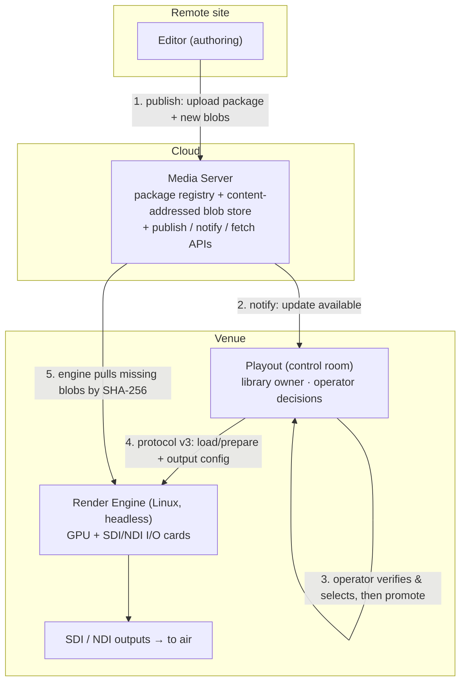

# Remote production — cloud distribution and a venue render engine (plan)

Status: **Plan — V2.** Remote publishing, remote engines and cloud distribution are the
V2 boundary in [`architecture.md`](architecture.md) and session rule 39. Rows marked
**Implemented** already exist as substrate; the rest is **Planned** or an **External gate**.
Authority: subordinate to [`architecture.md`](architecture.md); it must not weaken an
invariant. Where it does new work at the product edges, the invariants below are the fixed points.

## 1. The scenario

Modern remote/distributed production: the three products no longer share a machine.

- **Editor** — a designer, possibly far from the venue, authors scenes and **publishes**.
- **Media Server (cloud)** — receives published packages (scene + assets + fonts +
  materials + shaders + metadata), stores them, and tells subscribers an update exists.
- **Render Engine** — a **Linux server at the venue** with the I/O (SDI/NDI) cards,
  running headless, holding all GPU state and driving Program to air.
- **Playout** — in the control room, connected to the venue engine, fetching the
  published graphics, and letting an operator decide what goes live.

## 2. Invariants this must preserve (and one correction to the brief)

The brief says "the engine … fetches when there is an update and shows Playout there is
an update." Split that into a **control plane** and a **data plane**, because the naive
version would break the product boundary:

- **Control / decision plane stays in Playout.** The published scene library, the
  "update available" surface, the operator's verify/import/replace choice, promotion, and
  every Cue/Take/output command are **Playout's** (invariants 4 and 6; rules 39, 52). The
  engine does not own a library and does not decide what is on air.
- **Data plane is where the engine fetches.** The engine may pull *asset bytes* from the
  cloud by content hash into its cache — like a CDN edge — because "an engine on another
  machine cannot read the Editor's disk, so the bytes have to travel"
  (`services/render-engine/src/assets.rs`). That is a cache fill, not a decision.

So the accurate flow is: **the Media Server notifies Playout; the operator decides; the
engine, once Playout prepares a revision, fills its content-addressed cache by hash.** The
engine *reports* asset-readiness (`AssetFetchState`), and Playout *surfaces* it — which is
the honest form of "the engine shows Playout there is an update."

Also fixed:
1. The engine is the only renderer; Editor/Playout never rasterize (invariants 1–2).
2. A published revision is immutable; "replace" means promote a **new revision**, never
   patch one in place (invariant 6). Take IDs stay stable across republishes (rule 52).
3. No fallback may show different pixels (invariant 7): an engine that cannot fetch a
   required asset **blocks Take** rather than airing a substitute.
4. Program continues if Editor/Playout disconnect (invariant 5): the venue engine keeps
   airing the last prepared revision from its local cache when the cloud or the control
   room drops.

## 3. What already exists (reuse, don't reinvent)

| Substrate | Where | State |
| --- | --- | --- |
| **Content-addressed engine asset store**, SHA-256 keyed, dedup, reference-counted, disk-budgeted (8 GB default) | `services/render-engine/src/assets.rs` | **Implemented (skeleton)** — but `asset.*` protocol messages are refused with `CAPABILITY_UNSUPPORTED` today; the store is not yet driven over v3. |
| **Asset transports** `EngineLocal` / **`Http`** (fetch from an allowlisted host) / **`Upload`** (resumable chunks, `missing_chunks`) | `assets.rs`, `config.rs` (`allow_http_fetch`, `http_allowlist`) | **Implemented (skeleton)** — off by default: "an engine that fetches arbitrary URLs is a proxy." |
| **Headless remote engine mode** `--bind 0.0.0.0 --headless true --token-file …`, Vulkan backend, `--engine-id` per node | `services/render-engine` README, `config.rs`, `security.rs` | **Implemented** — Linux/Vulkan is a supported target; a non-loopback bind with no token refuses to start (rule 21). |
| **Output adapter trait + allowlist** (`OutputSink`, `enabled_adapters`; NDI feature-gated; recording/virtual/null; DeckLink/AJA declared-but-unimplemented) | `services/render-engine/src/outputs.rs` | NDI **Partial/External gate**; **SDI (DeckLink/AJA) Planned**; `hardware_certified` never from a flag. |
| **Fill / key as render modes** (SDI carries alpha as a separate key signal) | `outputs.rs`, `preview.rs` | **Implemented** for preview/monitors; carries to SDI unchanged. |
| **Package build + content-hashed asset storage** (`.gfxpkg` v2, checksums, embedded assets/fonts/automation) | `Editor/services/project-api` (`packageBuilder.ts`, `storage.ts`) | **Implemented** — the publish source. |
| **Playout library + staging + promote + events + engine/output control** | `Playout/services/playout-control` (`store.ts`, `preflight.ts`, `engineController.ts`, `/api/playout/scenes`, `/api/playout/events`, `/api/playout/engine/outputs`) | **Implemented (local)** — the control plane to extend to remote. |
| **Remote-endpoint intent** (endpoints add auth/TLS/replay/audit) | rule 1030, `architecture.md` §7 | Contract stated; transport Planned. |

The work is largely **activating and connecting these skeletons across a WAN**, not
inventing mechanisms.

## 4. The Media Server (cloud)

A content-addressed **package registry** over a **blob object store** (S3/MinIO/GCS or a
bespoke service). Two layers, both immutable:

- **Blob store** — every asset, font, shader and the scene JSON stored by **SHA-256**.
  Dedup falls out: republishing a scene with an unchanged logo transfers nothing; an
  operator "replace if a copy already exists" is a hash hit, not a copy. Integrity is the
  hash the package already carries.
- **Package registry** — append-only revisions keyed by `{ projectId, sceneId, revision }`
  with the `.gfxpkg` manifest, the blob digests it needs, capabilities/memory estimates,
  and the **Take ID** metadata. It is the authority for revision ordering and stable Take IDs
  across sites (rule 52).

APIs:

| API | Caller | Purpose |
| --- | --- | --- |
| `publish` (resumable upload) | Editor | Push the manifest + only the blobs the store lacks. |
| `notify` (webhook / WS / poll) | → Playout | "revision available for project/scene". |
| `fetch` (blob GET by digest, ranged/resumable) | Playout, **engine** | Pull content by SHA-256; allowlisted, authenticated. |
| `list` / `describe` | Playout | Enumerate revisions and their diffs for the operator. |

Auth: bearer or mTLS, per-project scoping, signed package (release signing is the open
item in [`architecture-review-compliance.md`](architecture-review-compliance.md) §31),
replay protection and an audit trail (rule 1030).

## 5. The operator update flow (the core ask)

1. **Editor publishes.** `project-api` builds the `.gfxpkg`, then uploads the manifest and
   any **new** blobs to the Media Server (unchanged blobs are skipped by hash).
2. **Media Server records** the immutable revision and **notifies** subscribers.
3. **Playout stages, never auto-promotes.** A Playout **sync agent** receives the notice,
   pulls the manifest, runs the existing independent `preflight.ts` validation, and raises
   an **"update available"** event on `/api/playout/events`. The live library is untouched.
4. **Operator verifies and selects.** A new **Incoming Updates** panel shows, per pending
   revision, a **diff** — what changed (assets added/replaced, materials, fonts, metadata),
   estimated memory, capability needs, and missing/uncertified requirements — and per item
   the operator chooses:
   - **Import** — a scene not in the library yet → promote as a new entry.
   - **Replace** — supersede an existing scene → promote a **new immutable revision**; the
     **Take ID stays stable** so a rehearsed number does not move mid-show (rule 52). The
     previous revision is retained for any take list still pinning it (rule 1029).
   - **Skip / defer** — leave it pending; nothing on air changes.
5. **Playout promotes** the chosen revision atomically into the library (existing `store`),
   then ensures the engine can render it: the **engine pulls the missing blobs by SHA-256**
   from the Media Server (or Playout pushes them via the `Upload` transport for a small or
   air-critical set). `AssetFetchState` drives a readiness indicator.
6. **On air.** Only after assets are `Cached` and preflight passes does the revision become
   Cue/Take-able. A missing asset **blocks Take** with an actionable report (invariant 7).

Nothing here lets the engine decide, and nothing patches a live revision in place.

## 6. The venue Linux engine + I/O

- **Deployment:** `grapix-render-engine --config engine.toml --bind 0.0.0.0 --headless true
  --token-file … --preferred-backend vulkan` on Linux. Non-loopback bind requires the token
  (rule 21); TLS terminates at a reverse proxy or via the TLS-ready transport.
- **Asset fetch:** enable `assets.allow_http_fetch = true` with
  `assets.http_allowlist = ["<media-server-host>"]` — the allowlist is what stops the engine
  becoming an open proxy. Blobs land in the content-addressed cache and survive restarts
  within the disk budget, so a cloud outage does not drop what is already cached.
- **SDI/NDI output (External gate):** implement `DeckLink` and/or `AJA` `OutputSink`
  adapters (today declared-but-unimplemented, reporting `available: false`). NDI already
  exists behind `--features ndi`. Fill and key travel as separate SDI signals using the
  existing key render mode. `enabled_adapters` on the venue engine adds `decklink`/`aja`;
  the default set stays non-live so no other deployment can accidentally go to air.
  **Genlock / reference sync** is required for broadcast SDI and is currently out of scope —
  an explicit gate.
- **`hardware_certified` stays false** until a real run against the card passes
  ([`hardware-certification-template.md`](hardware-certification-template.md)); compiling an
  SDK in is never certification.

## 7. Resilience over a WAN

- **Program is local to the venue.** The engine airs from its own cache; losing the cloud
  or the control room does not take the show off air (invariant 5). Playout reconciles when
  it reconnects (it already keeps liveness/readiness separate — rule 30).
- **Resumable transfer** both ways (`missing_chunks`, ranged blob GET) for flaky links.
- **Offline operation** from previously validated packages; Playout retains prior revisions
  (rule 1029). An operator can pre-stage a show before the link is needed.
- **Back-pressure:** distribution never touches the render thread; asset fetch is off the
  frame path, and an unready asset blocks Take rather than stalling Program.

## 8. Phased plan

- **RP-0 — Activate `asset.*` over protocol v3.** Turn the `CAPABILITY_UNSUPPORTED` refusal
  into a real path backed by `assets.rs`: `asset.register` (by digest + refs),
  `asset.upload` (resumable chunks), `asset.fetch` (from allowlisted host), `asset.release`.
  Playout pushes an asset a scene needs; the engine renders a scene whose bytes it did not
  have locally. Keep the refusal until this lands (do not stub).
- **RP-1 — Media Server.** Registry + blob store + `publish`/`fetch`/`notify`/`list`; Editor
  `project-api` publishes to it; content-addressed dedup end to end.
- **RP-2 — Playout sync + Incoming Updates.** Sync agent (subscribe/pull/stage/validate),
  the operator diff + Import/Replace/Skip UI, atomic promote, engine cache-fill by hash,
  readiness surfacing. This is the operator-facing deliverable.
- **RP-3 — Venue Linux engine + SDI.** Headless Linux deployment guide; DeckLink/AJA
  `OutputSink`; fill/key SDI; genlock; `enabled_adapters` per venue.
- **RP-4 — Remote security & reconciliation.** mTLS, package signing, replay protection,
  per-project scoping, WAN resumability, offline reconciliation, full audit.
- **RP-5 — Certification.** Hardware cert on the Linux box + card, soak, link-loss and
  output-loss injection, RAM/VRAM bounds.

Each phase keeps `check:boundaries`, `typecheck` and the Rust/TS suites green, and adds the
matching certification harness. V1 identifiers (engine/project/scene/state-revision/output-lease)
stay stable, so none of this is a scene or protocol rewrite (`architecture.md` "V2 boundary").

## 9. Open decisions (need sign-off)

1. **Engine pull vs Playout push for blobs.** Recommended: engine **pulls** large assets by
   hash from the allowlisted Media Server (edge-cache pattern); Playout **pushes** small or
   air-critical blobs via `Upload`. Both are content-addressed, so they interchange safely.
2. **Media Server backing store:** managed object store (S3/GCS/MinIO) behind a thin GrapiX
   API vs a bespoke service. Recommended: object store + thin API — do not rebuild a blob store.
3. **Notification:** webhook/WS push vs Playout poll. Recommended: push with poll fallback for restrictive venue networks.
4. **Take ID authority across sites.** The registry is the authority; confirm how a second
   authoring site reserves/frees Take IDs without collision (rule 52 must still hold).
5. **Topology:** one central Media Server vs per-venue mirror/CDN for large-asset locality.
6. **Trust:** mTLS everywhere vs bearer tokens + signed packages. Recommended: signed packages
   (integrity independent of transport) plus mTLS between venue and cloud.

## 10. Relationship to V1

Everything here is gated behind the V1 acceptance work in
[`main-architecture.md`](main-architecture.md) §7 — the native Editor Render View (M2),
engine-side role enforcement (M2), scene-domain keying (M2) and durable Program recovery
(M3). Remote distribution rides on those: role enforcement is what makes a WAN-exposed engine
safe, scene keying is what keeps two sites' scenes from colliding, and durable recovery is
what lets a venue engine resume Program after a restart with the cloud unreachable. Build the
V1 gates first; this plan is the V2 layer on top of them.
